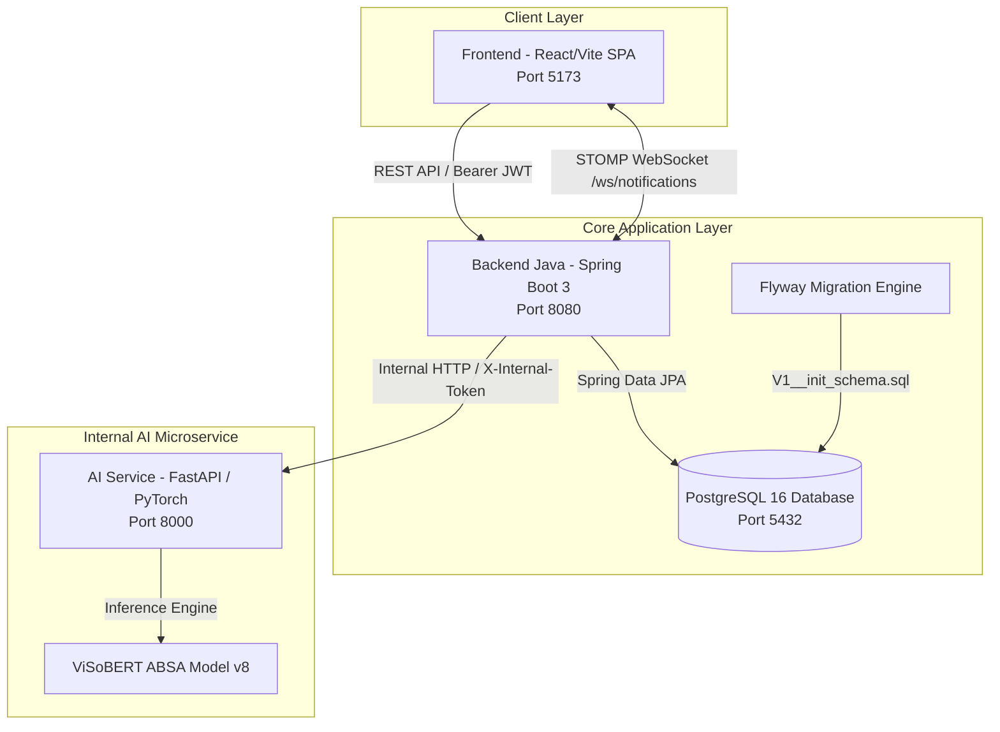
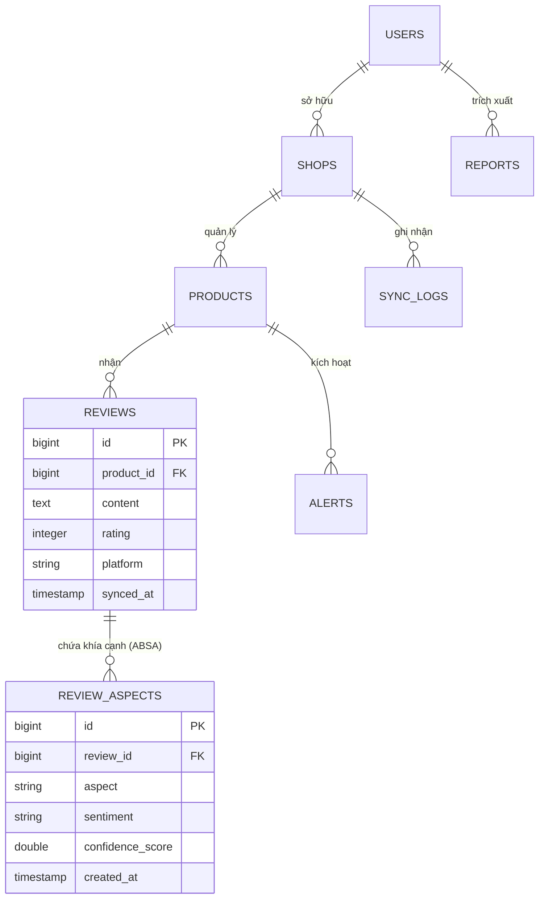
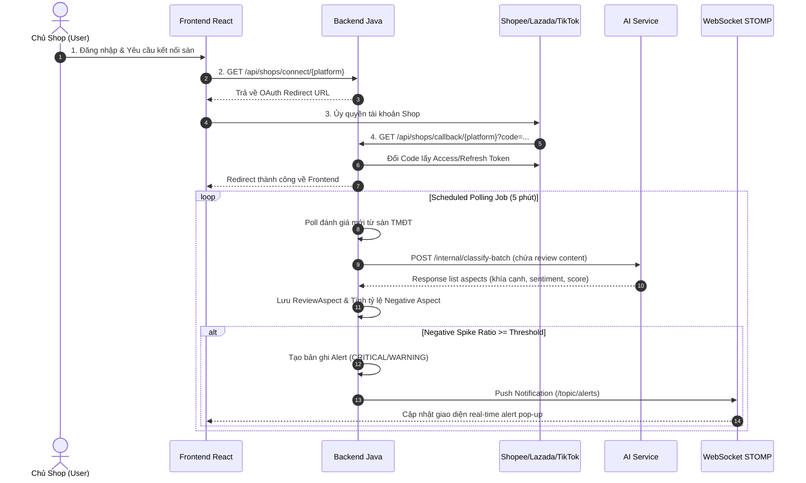

# Hệ Thống Phân Loại Phản Hồi Khách Hàng Đa Sàn TMĐT Bằng AI


---

## 1. GIỚI THIỆU

### Đề tài Nghiên cứu Khoa học

### Mục tiêu Đề tài

Dự án hướng tới xây dựng một nền tảng SaaS hoàn chỉnh hỗ trợ các nhà bán hàng (sellers/chủ shop) trên các sàn Thương mại Điện tử lớn tại Việt Nam (**Shopee**, **Lazada**, **TikTok Shop**):

1. **Thu thập & Đồng bộ phản hồi**: Tự động kết nối và đồng bộ đánh giá khách hàng (reviews) theo thời gian thực từ nhiều sàn TMĐT về một hệ thống quản lý tập trung.
2. **Phân tích khía cạnh chuyên sâu (ABSA - Aspect-Based Sentiment Analysis)**: Thay vì chỉ gắn nhãn tích cực/tiêu cực cho toàn bộ nhận xét, hệ thống sử dụng mô hình học sâu NLP tinh chỉnh (**ViSoBERT**) để trích xuất từng khía cạnh cụ thể (*giao hàng, chất lượng sản phẩm, thái độ phục vụ, giá cả, đóng gói...*) kèm cảm xúc tương ứng.
3. **Cảnh báo bất thường thời gian thực**: Phát hiện các đợt bùng nổ phản hồi tiêu cực (Negative Spike) theo từng khía cạnh sản phẩm và đẩy cảnh báo tức thì qua WebSocket tới giao diện người dùng.

---

## 2. KIẾN TRÚC HỆ THỐNG

Hệ thống được thiết kế theo kiến trúc **3-Tier Phân tán (Microservices/Service-Oriented)** nhằm đảm bảo tính mở rộng, bảo mật và tách biệt nghiệp vụ:



### Vai trò các thành phần

1. **Frontend (`frontend/`)**:
   * Single Page Application (SPA) xây dựng trên React 19 và Vite 6.
   * Giao diện người dùng hiện đại (Dark Mode), quản lý phiên làm việc JWT, biểu đồ trực quan hóa dữ liệu (Recharts), tích hợp client WebSocket STOMP nhận thông báo thời gian thực.
2. **Backend chính (`backend-java/`)**:
   * Sử dụng Spring Boot 3.3.2 (Java 17).
   * Đảm nhận toàn bộ nghiệp vụ nền tảng: Xác thực JWT, Quản lý User/Shop/Product/Review/Report, Tích hợp OAuth 2.0 đa sàn (Shopee, Lazada, TikTok), Tiến trình chạy ngầm Polling Review, Đẩy tin nhắn WebSocket.
3. **Internal AI Service (`ai-service/`)**:
   * Xây dựng trên Python 3.11 & FastAPI.
   * Đóng vai trò microservice nội bộ thực hiện tác vụ nặng: Tải mô hình `visobert_absa_v8` vào bộ nhớ, tính toán suy luận (inference) phân loại khía cạnh & cảm xúc.
   * Được bảo vệ bằng `InternalTokenMiddleware` (chỉ cho phép `backend-java` gọi qua header `X-Internal-Token`).

---

## 3. TECH STACK

Công nghệ được sử dụng chính xác từ cấu hình hiện tại của dự án:

| Thành phần | Công nghệ / Thư viện | Phiên bản |
| :--- | :--- | :--- |
| **Backend Java** | Java JDK | 17 |
| | Spring Boot Framework | 3.3.2 |
| | Spring Security | 6.x |
| | Spring Data JPA / Hibernate | 6.x |
| | JJWT (Java JWT) | 0.12.6 |
| | Flyway Migration | 10.x |
| | PostgreSQL Driver | 42.x |
| | Lombok | Latest |
| **AI Microservice** | Python | 3.11+ |
| | FastAPI | >= 0.110 |
| | Uvicorn | >= 0.27 |
| | PyTorch | Latest |
| | HuggingFace Transformers | >= 4.40.0 |
| | Pydantic | >= 2.0 |
| **Frontend** | React | ^19.0.0 |
| | Vite | ^6.0.0 |
| | React Router DOM | ^7.1.1 |
| | Recharts | ^2.15.0 |
| | @stomp/stompjs | ^7.0.0 |
| | Lucide React | ^0.469.0 |
| **Cơ sở dữ liệu** | PostgreSQL | 16-alpine |

---

## 4. CẤU TRÚC THƯ MỤC

```text
ABSA_App/
├── docker-compose.yml                # Dynamic multi-container setup (Full Stack)
├── docker-compose.dev.yml            # Local development PostgreSQL container setup
├── ai-service/                       # Microservice Python NLP/ABSA
│   ├── app/                          # Code chính: main.py, config.py, middleware.py, api/, core/
│   ├── models/visobert_absa_v8/      # Trọng số mô hình AI & label configuration
│   ├── requirements.txt              # Khai báo phụ thuộc Python
│   └── run.py                        # Launch script FastAPI/Uvicorn
├── backend-java/                     # Core Business Backend (Spring Boot)
│   ├── pom.xml                       # Maven build configuration
│   ├── src/main/java/com/feedbackai/ # Source code Java theo chuẩn Package-by-Layer
│   │   ├── entity/                   # JPA Entities (User, Shop, Product, Review, ReviewAspect, Alert...)
│   │   ├── repository/               # Spring Data JPA Repositories
│   │   ├── dto/                      # Request / Response DTOs
│   │   ├── service/                  # Business Logic & OAuth Handlers Strategy
│   │   ├── controller/               # REST Controllers
│   │   ├── aiclient/                 # HTTP Client gọi ai-service & Polling Scheduler
│   │   ├── notification/             # WebSocket Notification Service
│   │   ├── config/                   # Security, JWT, CORS, WebSocket config
│   │   └── common/                   # Shared response wrappers & Global Exception Handler
│   └── src/main/resources/           # application.yml & db/migration/V1__init_schema.sql
├── frontend/                         # React SPA Single Page Application
│   ├── src/
│   │   ├── components/               # UI components (Layout, Common, Charts)
│   │   ├── pages/                    # Các trang giao diện (Overview, Products, Reviews, Connect...)
│   │   ├── services/                 # API Client & Services layer
│   │   ├── context/                  # AuthContext
│   │   └── hooks/                    # Custom Hooks (useAuth, useWebSocket)
│   ├── package.json
│   └── vite.config.js
└── README.md
```

---

## 5. YÊU CẦU HỆ THỐNG (PREREQUISITES)

Để khởi chạy hệ thống ở môi trường phát triển (Development) hoặc sản xuất (Production), máy tính cần cài đặt:

* **Java Development Kit (JDK)**: Version 17 trở lên.
* **Node.js**: Version 18.x hoặc 20.x trở lên (kèm `npm` v9+).
* **Python**: Version 3.10 hoặc 3.11.
* **PostgreSQL**: Version 16 (hoặc Docker Desktop).
* **Docker & Docker Compose**: (Tùy chọn nếu chạy toàn bộ hệ thống bằng Container).

---

## 6. HƯỚNG DẪN CÀI ĐẶT & CHẠY (GETTING STARTED)

### Cách 1: Chạy từng Service độc lập (Dev Local)

#### Bước 1: Khởi chạy Database PostgreSQL

Chạy PostgreSQL dev container bằng `docker-compose.dev.yml`:

```bash
docker compose -f docker-compose.dev.yml up -d
```

#### Bước 2: Khởi chạy `ai-service` (Python)

```bash
cd ai-service

# Tạo môi trường ảo venv
python -m venv venv
# Windows:
.\venv\Scripts\activate
# Linux/macOS:
source venv/bin/activate

# Cài đặt các thư viện
pip install -r requirements.txt

# Tạo file .env từ .env.example
copy .env.example .env

# Tải trọng số mô hình AI (best_model.pt)
python scripts/download_model.py

# Chạy server AI
python run.py
# Server chạy tại http://localhost:8000
```

#### Bước 3: Khởi chạy `backend-java` (Spring Boot)

```bash
cd backend-java

# Biên dịch dự án
mvn clean compile

# Chạy ứng dụng Spring Boot
mvn spring-boot:run
# Server chạy tại http://localhost:8080
```

#### Bước 4: Khởi chạy `frontend` (React/Vite)

```bash
cd frontend

# Cài đặt các gói phụ thuộc
npm install

# Khởi chạy Vite dev server
npm run dev
# Ứng dụng chạy tại http://localhost:5173
```

---

### Cách 2: Khởi chạy Toàn bộ Hệ thống bằng Docker Compose

Chỉ cần một lệnh duy nhất để build và khởi chạy cả 4 services (`postgres`, `ai-service`, `backend-java`, `frontend`):

```bash
docker compose up --build -d
```

* **Frontend**: `http://localhost:5173`
* **Backend Java**: `http://localhost:8080`
* **AI Service**: `http://localhost:8000`

---

## 7. BIẾN MÔI TRƯỜNG (ENVIRONMENT VARIABLES)

### 1. AI Service (`ai-service/.env`)

| Biến môi trường | Mặc định | Mô tả |
| :--- | :--- | :--- |
| `ABSA_MODEL_DIR` | `models/visobert_absa_v8` | Đường dẫn tới thư mục lưu trọng số mô hình AI |
| `ABSA_DEVICE` | `auto` | Thiết bị tính toán (`auto`, `cuda`, `cpu`) |
| `ABSA_BATCH_SIZE` | `16` | Kích thước batch cho suy luận AI |
| `ABSA_HOST` | `0.0.0.0` | IP lắng nghe của AI Server |
| `ABSA_PORT` | `8000` | Port chạy AI Server |
| `INTERNAL_TOKEN` | `changeme` | Token xác thực nội bộ giữa backend-java và ai-service |

### 2. Backend Java (`backend-java/src/main/resources/application.yml`)

| Biến môi trường | Mặc định | Mô tả |
| :--- | :--- | :--- |
| `DB_HOST` | `localhost` | Host PostgreSQL |
| `DB_PORT` | `5432` | Port PostgreSQL |
| `DB_NAME` | `feedbackai` | Tên Cơ sở dữ liệu |
| `DB_USER` | `feedbackai` | Username DB |
| `DB_PASSWORD` | `feedbackai123` | Password DB |
| `JWT_SECRET` | *(chuỗi bí mật 256-bit)* | Mã khóa bí mật ký và xác thực JWT |
| `AI_SERVICE_URL` | `http://localhost:8000` | Địa chỉ AI Service |
| `INTERNAL_TOKEN` | `changeme` | Token nội bộ gửi sang AI Service |
| `FRONTEND_URL` | `http://localhost:5173` | Origin được phép CORS |
| `SHOPEE_CLIENT_ID` | `""` | App Key OAuth Shopee |
| `LAZADA_CLIENT_ID` | `""` | App Key OAuth Lazada |
| `TIKTOK_CLIENT_ID` | `""` | App Key OAuth TikTok Shop |

### 3. Frontend (`frontend/.env`)

| Biến môi trường | Mặc định | Mô tả |
| :--- | :--- | :--- |
| `VITE_API_BASE_URL` | `http://localhost:8080/api` | Base URL gọi REST API Backend Java |
| `VITE_WS_URL` | `ws://localhost:8080/ws/notifications` | URL kết nối STOMP WebSocket |

---

## 8. TÀI LIỆU API (API DOCUMENTATION)

### Endpoints Chính của `backend-java` (Public/Protected)

| Method | HTTP Path | Mô tả | Yêu cầu Auth |
| :--- | :--- | :--- | :---: |
| `POST` | `/api/auth/register` | Đăng ký tài khoản người dùng mới | Public |
| `POST` | `/api/auth/login` | Đăng nhập hệ thống, nhận JWT Token | Public |
| `GET` | `/api/auth/me` | Lấy thông tin tài khoản hiện tại | Bearer JWT |
| `GET` | `/api/shops` | Danh sách các shop E-commerce đã kết nối | Bearer JWT |
| `DELETE` | `/api/shops/{id}` | Ngắt kết nối shop | Bearer JWT |
| `GET` | `/api/shops/connect/{platform}` | Lấy URL ủy quyền OAuth (Shopee/Lazada/TikTok) | Bearer JWT |
| `GET` | `/api/shops/callback/{platform}` | Callback nhận authorization code và đổi token | Public |
| `GET` | `/api/products` | Danh sách sản phẩm của người dùng | Bearer JWT |
| `GET` | `/api/products/{id}` | Chi tiết sản phẩm | Bearer JWT |
| `GET` | `/api/products/{id}/top-aspects` | Top các khía cạnh nhận phản hồi nhiều nhất | Bearer JWT |
| `GET` | `/api/products/{id}/reviews` | Danh sách đánh giá sản phẩm (kèm khía cạnh ABSA) | Bearer JWT |
| `GET` | `/api/reviews/latest` | Dòng thời gian các đánh giá mới nhất | Bearer JWT |
| `GET` | `/api/alerts` | Danh sách cảnh báo cho người dùng | Bearer JWT |
| `PATCH` | `/api/alerts/{id}/read` | Đánh dấu cảnh báo đã đọc | Bearer JWT |
| `PATCH` | `/api/alerts/read-all` | Đánh dấu tất cả cảnh báo đã đọc | Bearer JWT |
| `GET` | `/api/dashboard/overview` | Tổng hợp chỉ số KPI, xu hướng cảm xúc & thị phần | Bearer JWT |

### Endpoints Nội bộ của `ai-service` (Internal Only)

* **`POST /internal/classify`**: Phân loại khía cạnh & cảm xúc cho 1 review. Yêu cầu header `X-Internal-Token`.
* **`POST /internal/classify-batch`**: Phân loại theo lô (batch processing) cho danh sách review. Yêu cầu header `X-Internal-Token`.
* **`GET /health`**: Health check kiểm tra trạng thái tải mô hình AI.

---

## 9. SƠ ĐỒ CƠ SỞ DỮ LIỆU (DATABASE SCHEMA)

Cơ sở dữ liệu PostgreSQL gồm 8 bảng chính được khởi tạo và quản lý tự động bởi Flyway (`db/migration/V1__init_schema.sql`):



---

## 10. LUỒNG NGHIỆP VỤ CHÍNH



---

## 11. TESTING & KIỂM THỬ

### Backend Java (Unit/Integration Test)

```bash
cd backend-java
mvn test
```

### AI Service Python

```bash
cd ai-service
python -m unittest discover tests
```

---

## 12. KẾT QUẢ DỰ ÁN & TÍNH NĂNG ĐÃ HOÀN THÀNH

### Đã hoàn thành

* [x] Tái cấu trúc thành công kiến trúc 3-Tier chuẩn phân tán (`ai-service`, `backend-java`, `frontend`).

* [x] Tích hợp mô hình AI NLP `visobert_absa_v8` phân tích Aspect-Based Sentiment Analysis chuẩn xác cho tiếng Việt.
* [x] Cơ chế bảo mật Microservice bằng `InternalTokenMiddleware` (`X-Internal-Token`).
* [x] Tích hợp Flyway Migration quản lý phiên bản cơ sở dữ liệu PostgreSQL.
* [x] Thiết kế Backend Java theo chuẩn **Package-by-LAYER** chuyên nghiệp.
* [x] Áp dụng Strategy Pattern (`OAuthHandler`) xử lý ủy quyền OAuth 2.0 đa sàn (Shopee, Lazada, TikTok).
* [x] Tiến trình chạy ngầm `ReviewPollingScheduler` tự động phát hiện biến động tiêu cực (Negative Spike) dựa trên tỷ lệ khía cạnh.
* [x] Đẩy dữ liệu thời gian thực qua WebSocket STOMP.
* [x] Giao diện SPA React 19 (Vite) đầy đủ tính năng và chuyển trang tự động.
* [x] Đóng gói Docker Compose & Dockerfiles phục vụ triển khai nhanh.

---

## 13. ĐÓNG GÓP & LIÊN HỆ

### Nhóm Thực Hiện Đề Tài

* **Sinh viên thực hiện**: [ĐIỀN TÊN TÁC GIẢ / NHÓM NGHIÊN CỨU]
* **Email liên hệ**: [ĐIỀN EMAIL LIÊN HỆ]
* **Giảng viên hướng dẫn**: [ĐIỀN TÊN GIẢNG VIÊN HƯỚNG DẪN]
* **Trường/Viện**: [ĐIỀN TÊN TRƯỜNG KHÓA VIỆN]

### Giấy phép (License)

Dự án được phát hành theo giấy phép **MIT License**. Chi tiết tham khảo tại file `LICENSE`.
