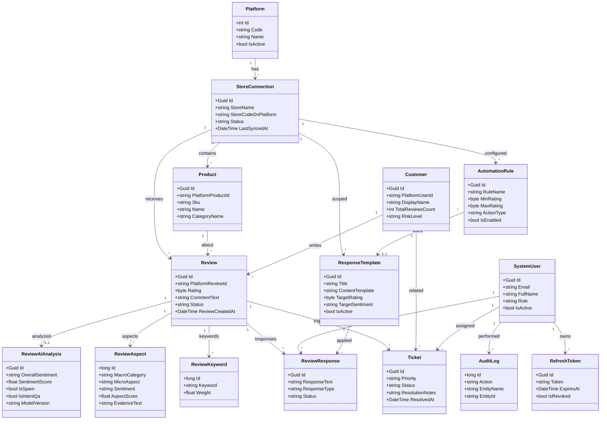

# TÀI LIỆU �ẶC TẢ HỆ TH�NG HIGEN-ABSA

**Dự án**: HIGEN-ABSA — Hệ thống Phân tích Cảm xúc �ánh giá Sản phẩm TM�T  
**�ơn vị phát triển**: Nhóm HIGEN-ABSA  
**Phiên bản tài liệu**: 1.0  
**Ngày phát hành**: 25/08/2026  
**Ngư�i soạn**: Nhóm phát triển dự án  

---

## 1. Giới thiệu chung

### 1.1. Bối cảnh và lý do xây dựng hệ thống

Hiện nay, các doanh nghiệp bán hàng trên sàn TM�T tại Việt Nam (Shopee, Lazada, Tiki, TikTok Shop) phải đối mặt với hàng trăm, thậm chí hàng nghìn lượt đánh giá mỗi ngày. Việc đ�c và phân loại thủ công từng đánh giá không chỉ tốn th�i gian mà còn dễ b� sót những phản hồi tiêu cực cần xử lý gấp. Một đánh giá 1 sao v� lỗi sản phẩm nếu không được phản hồi kịp th�i có thể ảnh hưởng nghiêm tr�ng đến uy tín cửa hàng.

Từ thực tế đó, nhóm phát triển đã xây dựng HIGEN-ABSA — một hệ thống tập trung hóa việc thu thập, phân tích và phản hồi đánh giá từ nhi�u sàn TM�T. �iểm khác biệt lớn nhất của hệ thống là khả năng phân tích cảm xúc theo từng khía cạnh cụ thể (Aspect-Based Sentiment Analysis) sử dụng mô hình AI ViSoBERT được huấn luyện riêng cho tiếng Việt. Thay vì chỉ biết "đánh giá này tiêu cực", hệ thống có thể chỉ ra rằng "khách hàng hài lòng v� chất lượng sản phẩm nhưng không hài lòng v� tốc độ giao hàng".

### 1.2. Hệ thống giải quyết vấn đ� gì?

Nói một cách đơn giản, HIGEN-ABSA giúp chủ shop và đội ngũ CSKH:

- **Không b� sót đánh giá quan tr�ng**: M�i đánh giá từ tất cả các sàn đ�u được tập trung v� một nơi, phân loại tự động theo mức độ cảm xúc.
- **Hiểu sâu hơn v� khách hàng**: Thay vì đ�c từng dòng, hệ thống tự động tách ra khách hàng đang khen hay chê cái gì — sản phẩm, giao hàng, giá cả hay dịch vụ.
- **Phản hồi nhanh hơn**: Có sẵn mẫu phản hồi, quy tắc tự động trả l�i, và gợi ý phản hồi từ AI.
- **Phát hiện sự cố sớm**: Dashboard cảnh báo khi một sản phẩm bất ng� nhận nhi�u đánh giá tiêu cực (negative spike), giúp doanh nghiệp phản ứng kịp th�i.
- **Quản lý chuyên nghiệp**: Hệ thống ticket giống như một bàn trợ giúp (help desk) nội bộ, đảm bảo m�i vấn đ� của khách hàng đ�u được theo dõi đến khi giải quyết xong.

### 1.3. Phạm vi hệ thống

Hệ thống gồm 9 nhóm nghiệp vụ chính, mỗi nhóm đảm nhận một mảng chức năng riêng biệt:

| Mã | Nghiệp vụ | Giải thích ngắn g�n |
|:---|:---|:---|
| NV1 | Xác thực & Quản lý ngư�i dùng | �ăng nhập, phân quy�n theo vai trò, quản lý tài khoản nhân viên |
| NV2 | Quản lý gian hàng đa sàn | Kết nối và theo dõi trạng thái các gian hàng trên Shopee, Lazada, Tiki, TikTok Shop |
| NV3 | Quản lý sản phẩm & khách hàng | Theo dõi danh mục sản phẩm, nhận diện khách hàng ti�m ẩn rủi ro (review bomber) |
| NV4 | Thu thập & quản lý đánh giá | �ồng bộ đánh giá từ sàn, quản lý trạng thái xử lý từng đánh giá |
| NV5 | Phân tích cảm xúc AI | Chạy mô hình ViSoBERT phân tích sentiment đa khía cạnh |
| NV6 | Phản hồi & tự động hóa | Tạo mẫu phản hồi, thiết lập quy tắc tự động trả l�i đánh giá |
| NV7 | Hệ thống ticket CSKH | Tạo và quản lý phiếu xử lý vấn đ� khi phát hiện đánh giá tiêu cực |
| NV8 | Dashboard & báo cáo | Hiển thị KPI, xu hướng cảm xúc, cảnh báo sản phẩm có vấn đ� |
| NV9 | Nhật ký hệ thống | Ghi lại m�i thao tác quan tr�ng để truy vết khi cần |

### 1.4. Ai sẽ sử dụng hệ thống?

Hệ thống phân chia 3 vai trò rõ ràng, phù hợp với cách tổ chức vận hành thực tế trong doanh nghiệp TM�T:

**Quản trị viên (Admin)** — thư�ng là trưởng phòng IT hoặc chủ doanh nghiệp. Có toàn quy�n trên hệ thống: tạo/khóa tài khoản nhân viên, xem nhật ký thao tác, cấu hình hệ thống. �ây là ngư�i duy nhất có quy�n truy cập phần quản lý ngư�i dùng và audit log.

**Quản lý cửa hàng (Store Manager)** — ngư�i phụ trách vận hành một hoặc nhi�u gian hàng trên sàn. Có thể kết nối gian hàng, xem dashboard, quản lý sản phẩm, thiết lập mẫu phản hồi và quy tắc tự động. �ây là vai trò sử dụng hệ thống nhi�u nhất hàng ngày.

**Nhân viên CSKH (CSKH Staff)** — nhân viên chăm sóc khách hàng tuyến đầu. Chủ yếu làm việc với màn hình ticket và đánh giá, xử lý phản hồi trực tiếp cho khách hàng. Không có quy�n thay đổi cấu hình hệ thống.

---

## 2. �ặc tả Use Case

### 2.1. Sơ đồ Use Case tổng quan

Sơ đồ dưới đây mô tả mối quan hệ giữa 3 tác nhân chính và các nhóm chức năng mà h� tương tác. Lưu ý rằng Admin kế thừa toàn bộ quy�n của Store Manager, và Store Manager kế thừa quy�n của CSKH Staff — nên sơ đồ chỉ thể hiện các chức năng đặc trưng của từng vai trò.

```mermaid
graph LR
    subgraph Actors
        ADMIN["👤 Admin"]
        SM["👤 Store Manager"]
        CSKH["👤 CSKH Staff"]
    end

    subgraph "NV1 — Xác thực"
        UC01["UC-01: �ăng nhập"]
        UC02["UC-02: �ăng ký tài khoản"]
        UC03["UC-03: �ổi mật khẩu"]
        UC04["UC-04: Quản lý tài khoản user"]
    end

    subgraph "NV2 — Gian hàng"
        UC05["UC-05: Kết nối gian hàng"]
        UC06["UC-06: �ồng bộ dữ liệu"]
    end

    subgraph "NV3 — Sản phẩm & Khách hàng"
        UC07["UC-07: Xem danh sách sản phẩm"]
        UC08["UC-08: Xem chi tiết SP + ABSA"]
        UC09["UC-09: Quản lý khách hàng"]
    end

    subgraph "NV4-5 — �ánh giá & AI"
        UC10["UC-10: Xem luồng đánh giá"]
        UC11["UC-11: Phân tích AI đánh giá"]
    end

    subgraph "NV6 — Phản hồi"
        UC12["UC-12: Quản lý mẫu phản hồi"]
        UC13["UC-13: Thiết lập quy tắc tự động"]
        UC14["UC-14: Gửi phản hồi thủ công"]
    end

    subgraph "NV7 — Ticket"
        UC15["UC-15: Xử lý ticket CSKH"]
        UC16["UC-16: Phân công ticket"]
    end

    subgraph "NV8-9 — Dashboard & Audit"
        UC17["UC-17: Xem dashboard"]
        UC18["UC-18: Xem nhật ký hệ thống"]
    end

    CSKH --> UC01 & UC03 & UC10 & UC14 & UC15 & UC17
    SM --> UC05 & UC06 & UC07 & UC08 & UC09 & UC12 & UC13 & UC16
    ADMIN --> UC02 & UC04 & UC18
```



### 2.2. Bảng Use Case chi tiết

Dưới đây là đặc tả chi tiết từng Use Case. Mỗi UC được mô tả đầy đủ gồm: tác nhân, ti�n đi�u kiện, luồng chính (happy path), luồng ngoại lệ (khi có lỗi), và hậu đi�u kiện (trạng thái hệ thống sau khi hoàn thành).

---

#### UC-01: �ăng nhập hệ thống

| Mục | Nội dung |
|:---|:---|
| **Mã UC** | UC-01 |
| **Tên** | �ăng nhập hệ thống |
| **Tác nhân** | Admin, Store Manager, CSKH Staff |
| **Mô tả** | Ngư�i dùng xác thực danh tính bằng email và mật khẩu để truy cập hệ thống |
| **Ti�n đi�u kiện** | Ngư�i dùng đã có tài khoản trong hệ thống và tài khoản đang ở trạng thái active |
| **Hậu đi�u kiện** | Hệ thống cấp Access Token (60 phút) và Refresh Token (7 ngày), ngư�i dùng được chuyển đến trang Dashboard |

**Luồng chính:**
1. Ngư�i dùng mở trang đăng nhập (`/login`).
2. Ngư�i dùng nhập email và mật khẩu.
3. Hệ thống kiểm tra email tồn tại trong bảng `SystemUsers`.
4. Hệ thống xác minh mật khẩu bằng BCrypt.
5. Hệ thống tạo JWT Access Token chứa thông tin userId, email, role.
6. Hệ thống tạo Refresh Token, lưu vào bảng `RefreshTokens` kèm IP đăng nhập.
7. Hệ thống trả v� bộ token và thông tin user cho frontend.
8. Frontend lưu token vào localStorage, chuyển hướng đến `/overview`.

**Luồng ngoại lệ:**
- 3a. Email không tồn tại → Hiển thị "Email hoặc mật khẩu không đúng" (không tiết lộ email có tồn tại hay không vì lý do bảo mật).
- 4a. Mật khẩu sai → Hiển thị "Email hoặc mật khẩu không đúng".
- 4b. Tài khoản bị khóa (`IsActive = false`) → Hiển thị "Tài khoản đã bị vô hiệu hóa, vui lòng liên hệ quản trị viên".

---

#### UC-02: �ăng ký tài khoản

| Mục | Nội dung |
|:---|:---|
| **Mã UC** | UC-02 |
| **Tên** | �ăng ký tài khoản mới |
| **Tác nhân** | Ngư�i dùng chưa có tài khoản |
| **Mô tả** | Tạo tài khoản mới để sử dụng hệ thống |
| **Ti�n đi�u kiện** | Email chưa được đăng ký trong hệ thống |
| **Hậu đi�u kiện** | Tài khoản mới được tạo với vai trò mặc định STORE_MANAGER, tự động đăng nhập |

**Luồng chính:**
1. Ngư�i dùng mở trang đăng ký (`/register`).
2. Ngư�i dùng nhập h� tên, email, mật khẩu, và xác nhận mật khẩu.
3. Hệ thống kiểm tra email chưa tồn tại.
4. Hệ thống hash mật khẩu bằng BCrypt, tạo bản ghi `SystemUser` với role `STORE_MANAGER`.
5. Hệ thống tự động đăng nhập (tạo token), chuyển hướng đến Dashboard.

**Luồng ngoại lệ:**
- 3a. Email đã tồn tại → Hiển thị "Email đã được sử dụng".
- 2a. Mật khẩu xác nhận không khớp → Hiển thị lỗi validation.

---

#### UC-03: �ổi mật khẩu

| Mục | Nội dung |
|:---|:---|
| **Mã UC** | UC-03 |
| **Tên** | �ổi mật khẩu cá nhân |
| **Tác nhân** | Admin, Store Manager, CSKH Staff |
| **Mô tả** | Ngư�i dùng thay đổi mật khẩu đăng nhập của mình |
| **Ti�n đi�u kiện** | �ã đăng nhập |
| **Hậu đi�u kiện** | Mật khẩu mới được lưu (BCrypt hash), phiên đăng nhập hiện tại vẫn giữ nguyên |

**Luồng chính:**
1. Ngư�i dùng vào trang Cài đặt (`/settings`).
2. Ngư�i dùng nhập mật khẩu hiện tại, mật khẩu mới, và xác nhận mật khẩu mới.
3. Hệ thống xác minh mật khẩu hiện tại đúng.
4. Hệ thống hash mật khẩu mới, cập nhật vào bảng `SystemUsers`.
5. Hiển thị thông báo "�ổi mật khẩu thành công".

**Luồng ngoại lệ:**
- 3a. Mật khẩu hiện tại không đúng → Hiển thị "Mật khẩu hiện tại không chính xác".

---

#### UC-04: Quản lý tài khoản ngư�i dùng

| Mục | Nội dung |
|:---|:---|
| **Mã UC** | UC-04 |
| **Tên** | Quản lý tài khoản ngư�i dùng (Admin) |
| **Tác nhân** | Admin |
| **Mô tả** | Admin tạo, sửa, khóa tài khoản cho nhân viên trong tổ chức |
| **Ti�n đi�u kiện** | �ã đăng nhập với vai trò ADMIN |
| **Hậu đi�u kiện** | Tài khoản được tạo/cập nhật/khóa trong bảng `SystemUsers` |

**Luồng chính (tạo tài khoản):**
1. Admin vào trang Quản lý ngư�i dùng (`/users`).
2. Admin nhấn "Thêm ngư�i dùng".
3. Admin nhập email, h� tên, số điện thoại, ch�n vai trò (STORE_MANAGER hoặc CSKH_STAFF), nhập mật khẩu ban đầu.
4. Hệ thống kiểm tra email chưa tồn tại, tạo tài khoản mới.
5. Tài khoản xuất hiện trong danh sách.

**Luồng chính (khóa tài khoản):**
1. Admin ch�n tài khoản cần khóa.
2. Hệ thống đặt `IsActive = false`, thu hồi tất cả refresh token của user đó.
3. Nhân viên bị khóa sẽ không thể đăng nhập nữa, nhưng lịch sử thao tác vẫn được giữ lại.

**Luồng ngoại lệ:**
- 3a. Email đã tồn tại → Hiển thị lỗi.
- Admin không thể khóa chính tài khoản của mình.

---

#### UC-05: Kết nối gian hàng

| Mục | Nội dung |
|:---|:---|
| **Mã UC** | UC-05 |
| **Tên** | Kết nối gian hàng TM�T |
| **Tác nhân** | Admin, Store Manager |
| **Mô tả** | Thêm kết nối đến gian hàng trên sàn TM�T (Shopee, Lazada, Tiki, TikTok Shop) để bắt đầu thu thập đánh giá |
| **Ti�n đi�u kiện** | �ã đăng nhập. �ã có thông tin API sàn (mã shop, access token) |
| **Hậu đi�u kiện** | Bản ghi `StoreConnection` mới với status CONNECTED được tạo |

**Luồng chính:**
1. Ngư�i dùng vào trang Kết nối (`/connect`).
2. Nhấn "Thêm gian hàng".
3. Ch�n sàn TM�T từ dropdown (dữ liệu từ bảng `Platforms`).
4. Nhập tên gian hàng, mã shop trên sàn, access token và refresh token API sàn.
5. Hệ thống tạo bản ghi `StoreConnection`, status = `CONNECTED`.
6. Gian hàng mới xuất hiện trong danh sách với badge "�ã kết nối".

**Luồng ngoại lệ:**
- 4a. Mã shop đã tồn tại trên cùng sàn → Hiển thị cảnh báo trùng lặp.
- Token hết hạn sau một th�i gian → Status tự động chuyển sang `EXPIRED`, hiển thị cảnh báo trên giao diện.

---

#### UC-06: �ồng bộ dữ liệu từ sàn

| Mục | Nội dung |
|:---|:---|
| **Mã UC** | UC-06 |
| **Tên** | �ồng bộ dữ liệu đánh giá từ sàn TM�T |
| **Tác nhân** | Admin, Store Manager |
| **Mô tả** | Kích hoạt lấy đánh giá mới từ sàn, phân tích AI, và lưu vào database |
| **Ti�n đi�u kiện** | Gian hàng có status CONNECTED, token API sàn còn hạn |
| **Hậu đi�u kiện** | �ánh giá mới được lưu vào bảng `Reviews`, kết quả AI vào `ReviewAIAnalysis` và `ReviewAspects`, ticket CSKH tự động tạo nếu phát hiện đánh giá tiêu cực |

**Luồng chính:**
1. Ngư�i dùng nhấn nút "�ồng bộ" trên gian hàng.
2. Hệ thống g�i API sàn TM�T, lấy danh sách đánh giá mới kể từ `LastSyncedAt`.
3. Với mỗi đánh giá: kiểm tra `PlatformReviewId` để l�c trùng, tạo/cập nhật `Product` và `Customer`, tạo bản ghi `Review`.
4. Gửi batch nội dung đánh giá qua InferenceService (ViSoBERT ONNX).
5. Lưu kết quả phân tích: `ReviewAIAnalysis`, `ReviewAspects`, `ReviewKeywords`.
6. Với đánh giá có sentiment NEG và score > ngưỡng: tạo `Ticket` tự động.
7. Kiểm tra `AutomationRules`, nếu match: tạo `ReviewResponse` tự động.
8. Cập nhật `LastSyncedAt` của gian hàng.

**Luồng ngoại lệ:**
- 2a. Token API sàn hết hạn → Cập nhật status gian hàng thành `EXPIRED`, thông báo ngư�i dùng cần cấp lại token.
- 2b. API sàn timeout → Ghi log lỗi, giữ nguyên `LastSyncedAt`, cho phép retry.

---

#### UC-07: Xem danh sách sản phẩm

| Mục | Nội dung |
|:---|:---|
| **Mã UC** | UC-07 |
| **Tên** | Xem và tìm kiếm sản phẩm |
| **Tác nhân** | Admin, Store Manager, CSKH Staff |
| **Mô tả** | Xem danh sách sản phẩm đã đồng bộ, tìm kiếm theo tên hoặc SKU |
| **Ti�n đi�u kiện** | �ã đăng nhập |
| **Hậu đi�u kiện** | Không thay đổi dữ liệu (read-only) |

**Luồng chính:**
1. Ngư�i dùng vào trang Sản phẩm (`/products`).
2. Hệ thống hiển thị danh sách sản phẩm phân trang (20 SP/trang).
3. Ngư�i dùng có thể l�c theo gian hàng, tìm kiếm theo tên/SKU.
4. Nhấn vào sản phẩm để xem chi tiết (→ UC-08).

---

#### UC-08: Xem chi tiết sản phẩm và phân tích ABSA

| Mục | Nội dung |
|:---|:---|
| **Mã UC** | UC-08 |
| **Tên** | Xem chi tiết sản phẩm kèm phân tích cảm xúc đa khía cạnh |
| **Tác nhân** | Admin, Store Manager, CSKH Staff |
| **Mô tả** | Xem thông tin sản phẩm, phân bố rating, và tổng hợp cảm xúc theo từng khía cạnh (PRODUCT, SHIPPING, SERVICE, PRICE) |
| **Ti�n đi�u kiện** | Sản phẩm tồn tại và đã có đánh giá được phân tích AI |
| **Hậu đi�u kiện** | Không thay đổi dữ liệu |

**Luồng chính:**
1. Ngư�i dùng nhấn vào sản phẩm từ danh sách.
2. Hệ thống hiển thị: thông tin cơ bản (tên, SKU, ảnh, danh mục), biểu đồ phân bố rating (1-5 sao), tổng hợp sentiment theo Macro Category.
3. Phần sentiment summary cho biết: "80% ý kiến v� PRODUCT là tích cực, 60% ý kiến v� SHIPPING là tiêu cực" — giúp quản lý nhanh chóng biết sản phẩm đang yếu ở mảng nào.
4. Bên dưới là danh sách đánh giá gần nhất của sản phẩm.

---

#### UC-09: Quản lý khách hàng và mức rủi ro

| Mục | Nội dung |
|:---|:---|
| **Mã UC** | UC-09 |
| **Tên** | Quản lý khách hàng và đánh giá mức rủi ro |
| **Tác nhân** | Admin, Store Manager |
| **Mô tả** | Xem danh sách khách hàng, lịch sử đánh giá, và gán mức rủi ro (NORMAL / POTENTIAL_BOMMER / VIP) |
| **Ti�n đi�u kiện** | �ã đăng nhập |
| **Hậu đi�u kiện** | Cột `RiskLevel` trong bảng `Customers` được cập nhật |

**Luồng chính:**
1. Ngư�i dùng vào trang Khách hàng (`/customers`).
2. Xem danh sách phân trang, l�c theo mức rủi ro.
3. Nhấn vào khách hàng để xem chi tiết: tên, avatar, tổng đánh giá, lịch sử đánh giá.
4. Nếu nhận thấy hành vi bất thư�ng (VD: 10 đánh giá 1 sao trong 1 tuần), ngư�i dùng đổi risk level sang `POTENTIAL_BOMMER`.
5. Hệ thống cập nhật database và hiển thị badge cảnh báo trên khách hàng này.

---

#### UC-10: Xem và l�c luồng đánh giá

| Mục | Nội dung |
|:---|:---|
| **Mã UC** | UC-10 |
| **Tên** | Xem luồng đánh giá với bộ l�c đa chi�u |
| **Tác nhân** | Admin, Store Manager, CSKH Staff |
| **Mô tả** | Xem tất cả đánh giá từ m�i sàn, l�c theo nhi�u tiêu chí để tìm đánh giá cần xử lý |
| **Ti�n đi�u kiện** | �ã đăng nhập, đã có đánh giá trong hệ thống |
| **Hậu đi�u kiện** | Không thay đổi dữ liệu |

**Luồng chính:**
1. Ngư�i dùng vào trang �ánh giá (`/reviews`).
2. Hệ thống hiển thị feed đánh giá mới nhất.
3. Ngư�i dùng l�c theo: gian hàng, sản phẩm, rating (1-5), sentiment (POS/NEU/NEG), trạng thái (PENDING/REPLIED/FAILED/SKIPPED), và tìm kiếm từ khóa.
4. Mỗi đánh giá hiển thị: nội dung, rating, sentiment badge (màu xanh/vàng/đ�), thông tin khách hàng, sản phẩm.
5. Nhấn vào đánh giá để xem chi tiết + kết quả AI + lịch sử phản hồi.

---

#### UC-11: Phân tích AI một đánh giá

| Mục | Nội dung |
|:---|:---|
| **Mã UC** | UC-11 |
| **Tên** | Phân tích cảm xúc AI cho đánh giá |
| **Tác nhân** | Hệ thống (tự động), hoặc ngư�i dùng qua trang predict |
| **Mô tả** | Chạy mô hình ViSoBERT ONNX phân tích nội dung đánh giá, xác định sentiment tổng thể và chi tiết theo từng khía cạnh |
| **Ti�n đi�u kiện** | Mô hình ViSoBERT đã load thành công (health check = ok), nội dung đánh giá không rỗng |
| **Hậu đi�u kiện** | Bản ghi `ReviewAIAnalysis`, danh sách `ReviewAspects`, danh sách `ReviewKeywords` được tạo |

**Luồng chính:**
1. Hệ thống nhận nội dung đánh giá (từ quá trình sync hoặc từ endpoint `/predict`).
2. Tokenizer chuyển văn bản thành token IDs.
3. ONNX Runtime chạy inference trên CPU, trả v� logits.
4. Post-processing: sigmoid → xác suất, so sánh với threshold → xác định labels.
5. Xác định Overall Sentiment (POS/NEU/NEG/MIXED) dựa trên tổng hợp các aspect sentiments.
6. Trích xuất keywords quan tr�ng.
7. Lưu kết quả vào database.

**Luồng ngoại lệ:**
- 1a. Nội dung đánh giá chỉ có emoji hoặc quá ngắn (< 3 ký tự) → �ánh dấu sentiment NEU với score thấp.
- 3a. ONNX Runtime lỗi → Ghi log, b� qua đánh giá này, không tạo bản ghi AI.

---

#### UC-12: Quản lý mẫu phản hồi

| Mục | Nội dung |
|:---|:---|
| **Mã UC** | UC-12 |
| **Tên** | Tạo và quản lý mẫu phản hồi đánh giá |
| **Tác nhân** | Admin, Store Manager |
| **Mô tả** | Tạo sẵn các mẫu phản hồi cho từng tình huống (rating, sentiment, aspect) để nhân viên sử dụng nhanh hoặc để automation rule tham chiếu |
| **Ti�n đi�u kiện** | �ã đăng nhập |
| **Hậu đi�u kiện** | Bản ghi `ResponseTemplate` mới/cập nhật trong database |

**Luồng chính:**
1. Ngư�i dùng vào trang Mẫu & Quy tắc (`/templates`).
2. Nhấn "Tạo mẫu mới".
3. Nhập tiêu đ� (VD: "Cảm ơn đánh giá 5 sao"), nội dung mẫu (hỗ trợ biến `{customer_name}`, `{product_name}`).
4. Tùy ch�n: chỉ định đi�u kiện áp dụng (target rating, sentiment, aspect) và scope gian hàng.
5. Lưu → Mẫu có thể được dùng khi phản hồi thủ công hoặc tham chiếu từ automation rule.

---

#### UC-13: Thiết lập quy tắc tự động phản hồi

| Mục | Nội dung |
|:---|:---|
| **Mã UC** | UC-13 |
| **Tên** | Thiết lập quy tắc tự động phản hồi đánh giá |
| **Tác nhân** | Admin, Store Manager |
| **Mô tả** | Cấu hình đi�u kiện và hành động tự động: khi đánh giá mới match đi�u kiện, hệ thống tự gửi phản hồi mà không cần nhân viên can thiệp |
| **Ti�n đi�u kiện** | �ã có ít nhất 1 mẫu phản hồi. Gian hàng đã kết nối |
| **Hậu đi�u kiện** | Bản ghi `AutomationRule` được tạo, đánh giá mới phù hợp sẽ tự động được phản hồi |

**Luồng chính:**
1. Ngư�i dùng vào tab "Quy tắc tự động" trên trang Mẫu & Quy tắc.
2. Nhấn "Tạo quy tắc".
3. Nhập: tên quy tắc, ch�n gian hàng, khoảng rating (VD: 4-5), sentiments áp dụng (VD: POS).
4. Ch�n hành động: dùng template nào, delay bao nhiêu phút trước khi gửi.
5. Bật/tắt quy tắc.
6. Khi đánh giá mới match → hệ thống tự tạo `ReviewResponse` (type AUTOMATIC) và gửi lên sàn.

**Luồng ngoại lệ:**
- Nhi�u quy tắc match cùng 1 đánh giá → Quy tắc đầu tiên được áp dụng, các quy tắc sau bị b� qua.

---

#### UC-14: Gửi phản hồi thủ công cho đánh giá

| Mục | Nội dung |
|:---|:---|
| **Mã UC** | UC-14 |
| **Tên** | Gửi phản hồi thủ công cho đánh giá |
| **Tác nhân** | Admin, Store Manager, CSKH Staff |
| **Mô tả** | Nhân viên đ�c đánh giá, xem gợi ý AI, ch�n hoặc soạn nội dung phản hồi, gửi lên sàn TM�T |
| **Ti�n đi�u kiện** | �ánh giá ở trạng thái PENDING (chưa phản hồi). �ã đăng nhập |
| **Hậu đi�u kiện** | Bản ghi `ReviewResponse` (type MANUAL) được tạo, trạng thái `Review` chuyển sang REPLIED |

**Luồng chính:**
1. Nhân viên mở chi tiết đánh giá.
2. Xem kết quả phân tích AI: sentiment, aspects, gợi ý phản hồi.
3. Ch�n mẫu phản hồi phù hợp hoặc viết nội dung tự do.
4. Nhấn "Gửi phản hồi".
5. Hệ thống tạo `ReviewResponse`, g�i API sàn gửi phản hồi.
6. Nếu thành công: cập nhật status = SUCCESS, đổi review status = REPLIED.
7. Nếu thất bại: status = FAILED, ghi error message, review status = FAILED.

**Luồng ngoại lệ:**
- 5a. API sàn lỗi → Lưu response với status FAILED, hiển thị thông báo lỗi, cho phép retry sau.

---

#### UC-15: Xử lý ticket CSKH

| Mục | Nội dung |
|:---|:---|
| **Mã UC** | UC-15 |
| **Tên** | Xử lý và giải quyết ticket CSKH |
| **Tác nhân** | CSKH Staff, Store Manager, Admin |
| **Mô tả** | Nhân viên nhận ticket, xem đánh giá gốc và phân tích AI, liên hệ khách hàng, giải quyết vấn đ� và đóng ticket |
| **Ti�n đi�u kiện** | Ticket tồn tại trong hệ thống |
| **Hậu đi�u kiện** | Ticket chuyển sang RESOLVED hoặc CLOSED, ghi chú giải quyết được lưu |

**Luồng chính:**
1. Nhân viên vào trang Ticket (`/tickets`), xem danh sách ticket được gán cho mình (hoặc tất cả ticket OPEN).
2. Mở ticket → Xem đánh giá gốc, kết quả AI (sentiment, aspects, root cause), thông tin khách hàng.
3. Nhân viên liên hệ khách hàng (qua chat sàn, điện thoại, v.v.).
4. Nhân viên gửi phản hồi trên sàn (→ UC-14).
5. Nhấn "Giải quyết ticket", nhập ghi chú (VD: "�ã g�i điện xin lỗi, gửi voucher 50k").
6. Hệ thống cập nhật status = RESOLVED, ghi `ResolvedAt`.

**Luồng ngoại lệ:**
- 3a. Khách hàng không phản hồi → Nhân viên có thể để ticket ở IN_PROGRESS, ghi chú "�ã liên hệ, ch� KH phản hồi".
- Quản lý có thể đóng ticket trực tiếp (CLOSED) nếu đánh giá xác định không cần xử lý.

---

#### UC-16: Phân công ticket cho nhân viên

| Mục | Nội dung |
|:---|:---|
| **Mã UC** | UC-16 |
| **Tên** | Phân công ticket cho nhân viên CSKH |
| **Tác nhân** | Admin, Store Manager |
| **Mô tả** | Quản lý gán ticket OPEN cho nhân viên CSKH cụ thể để xử lý |
| **Ti�n đi�u kiện** | Ticket ở trạng thái OPEN, nhân viên CSKH tồn tại và active |
| **Hậu đi�u kiện** | Ticket chuyển sang IN_PROGRESS, `AssignedToUserId` được cập nhật |

**Luồng chính:**
1. Quản lý mở danh sách ticket OPEN.
2. Ch�n ticket, nhấn "Phân công".
3. Ch�n nhân viên CSKH từ danh sách.
4. Hệ thống gán ticket, đổi status sang IN_PROGRESS.

---

#### UC-17: Xem Dashboard tổng quan

| Mục | Nội dung |
|:---|:---|
| **Mã UC** | UC-17 |
| **Tên** | Xem Dashboard và báo cáo KPI |
| **Tác nhân** | Admin, Store Manager, CSKH Staff |
| **Mô tả** | Xem tổng quan sức kh�e cửa hàng: KPI, xu hướng cảm xúc, phân bổ đánh giá theo sàn, cảnh báo sản phẩm có vấn đ� |
| **Ti�n đi�u kiện** | �ã đăng nhập |
| **Hậu đi�u kiện** | Không thay đổi dữ liệu |

**Luồng chính:**
1. Ngư�i dùng vào trang Tổng quan (`/overview`) — đây là trang mặc định sau đăng nhập.
2. Hệ thống hiển thị:
   - Thẻ KPI: tổng đánh giá hôm nay, tỷ lệ tích cực (%), tổng sản phẩm, tổng gian hàng, ticket đang mở.
   - Biểu đồ đư�ng: xu hướng POS/NEU/NEG theo ngày.
   - Biểu đồ tròn: phân bổ đánh giá theo sàn.
   - Bảng cảnh báo: sản phẩm có negative spike.
   - Danh sách: đánh giá mới nhất (live feed).
3. Dữ liệu tự động tải lại khi filter thay đổi (khoảng ngày, gian hàng).

---

#### UC-18: Xem nhật ký hệ thống

| Mục | Nội dung |
|:---|:---|
| **Mã UC** | UC-18 |
| **Tên** | Xem nhật ký hệ thống (Audit Log) |
| **Tác nhân** | Admin |
| **Mô tả** | Xem lịch sử thao tác của tất cả ngư�i dùng: ai đã làm gì, lúc nào, thay đổi cái gì |
| **Ti�n đi�u kiện** | �ã đăng nhập với vai trò ADMIN |
| **Hậu đi�u kiện** | Không thay đổi dữ liệu |

**Luồng chính:**
1. Admin vào trang Audit Log.
2. Hệ thống hiển thị danh sách thao tác phân trang, mới nhất trước.
3. Mỗi dòng hiển thị: th�i gian, ngư�i thực hiện, hành động (VD: REPLY_REVIEW), entity bị ảnh hưởng, IP nguồn.
4. Admin có thể l�c theo: loại hành động, ngư�i dùng, khoảng th�i gian.
5. Nhấn vào dòng log để xem chi tiết: giá trị cũ vs giá trị mới (JSON diff).

---

## 3. Kiến trúc tổng thể

### 3.1. Lựa ch�n kiến trúc

Nhóm phát triển ch�n kiến trúc **Monolithic API + SPA Frontend** cho phiên bản đầu tiên. Lý do là dự án đang trong giai đoạn MVP, quy mô đội ngũ nh� (2-3 developer), và việc tách microservice ở giai đoạn này sẽ tăng độ phức tạp vận hành mà chưa mang lại lợi ích rõ ràng. Khi hệ thống phát triển lên, kiến trúc này hoàn toàn có thể tách dần thành các service độc lập (đặc biệt là AI Inference Service và Sync Service).

Kiến trúc hiện tại gồm 4 tầng chính:

**Tầng giao diện (Frontend)**: Ứng dụng React chạy trên trình duyệt, giao tiếp với backend qua REST API. Ngư�i dùng truy cập qua địa chỉ `http://localhost:5173` trong môi trư�ng phát triển.

**Tầng API (Backend)**: ASP.NET Core Web API xử lý toàn bộ logic nghiệp vụ, xác thực JWT, và đi�u phối dữ liệu. Chạy trên port `5058`.

**Tầng AI**: Module inference chạy trong cùng process với backend (in-process), sử dụng ONNX Runtime để chạy mô hình ViSoBERT trên CPU. Thiết kế này giúp giảm latency vì không cần g�i qua mạng, đồng th�i đơn giản hóa việc triển khai.

**Tầng dữ liệu**: SQL Server lưu trữ toàn bộ dữ liệu nghiệp vụ. Sử dụng Entity Framework Core theo hướng Code-First, nghĩa là cấu trúc database được định nghĩa hoàn toàn từ code C# và tự động tạo bảng khi ứng dụng khởi động.

### 3.2. Cách các tầng giao tiếp với nhau

Luồng hoạt động cơ bản như sau: Ngư�i dùng thao tác trên giao diện React → trình duyệt gửi HTTP request kèm JWT token đến backend → backend xác thực token, xử lý logic nghiệp vụ, truy vấn database qua Entity Framework → trả kết quả JSON v� cho frontend hiển thị.

Riêng với chức năng phân tích AI, backend g�i trực tiếp vào InferenceService (cùng process), service này nạp mô hình ONNX vào bộ nhớ một lần duy nhất khi ứng dụng khởi động (singleton), sau đó xử lý các yêu cầu phân tích mà không cần load lại model.

### 3.3. Công nghệ sử dụng và lý do ch�n

**Backend — .NET 10 + ASP.NET Core**

Nhóm ch�n .NET thay vì Node.js hay Python vì một số lý do: hiệu năng cao hơn đáng kể khi xử lý đồng th�i nhi�u request (thread-per-request thay vì event loop), hệ thống type-safe giúp giảm lỗi runtime, và đặc biệt là .NET có thư viện ONNX Runtime chính chủ từ Microsoft hoạt động rất ổn định trên Windows — môi trư�ng phát triển chính của nhóm.

Các thư viện chính:

- **Entity Framework Core 10.0.11**: ORM chính thức của .NET, hỗ trợ migration, query LINQ, và tự động tạo database schema từ code.
- **BCrypt.Net-Next 4.2.0**: Thư viện hash mật khẩu sử dụng thuật toán BCrypt — chuẩn công nghiệp cho việc lưu trữ mật khẩu an toàn.
- **Microsoft.ML.OnnxRuntime 1.22.0**: Runtime inference cho mô hình AI ở format ONNX, cho phép chạy mô hình Python-trained trên .NET mà không cần cài Python.
- **Swashbuckle.AspNetCore 10.2.3**: Tự động sinh tài liệu API dạng Swagger UI, giúp frontend developer có thể test API trực tiếp trên trình duyệt.

**Frontend — React 19 + Vite 8**

React được ch�n vì đây là thư viện UI phổ biến nhất, dễ tuyển dụng nhân sự, và hệ sinh thái thư viện phong phú. Vite được dùng thay cho webpack vì tốc độ build nhanh hơn nhi�u lần, đặc biệt trong quá trình phát triển (hot module replacement gần như tức thì).

Các thư viện hỗ trợ:
- **React Router DOM 7.18.2**: Quản lý đi�u hướng trang trong ứng dụng SPA.
- **Recharts 2.15.0**: Vẽ biểu đồ cho dashboard (line chart xu hướng, pie chart phân bổ, v.v.).
- **Lucide React 1.33.0**: Bộ icon SVG nhẹ, đẹp, thay thế cho FontAwesome.
- **TailwindCSS 4.3.3**: Framework CSS utility-first, giúp viết giao diện nhanh mà không cần tạo nhi�u file CSS riêng.

**AI — ViSoBERT ONNX**

Mô hình ViSoBERT được nhóm nghiên cứu huấn luyện riêng cho bài toán phân tích cảm xúc tiếng Việt trên dữ liệu đánh giá TM�T. Sau khi huấn luyện bằng PyTorch, mô hình được export sang format ONNX để có thể chạy trên .NET mà không cần cài đặt Python environment — đơn giản hóa đáng kể việc triển khai.

---

## 4. Cơ sở dữ liệu

### 4.1. Tổng quan thiết kế

Database được thiết kế theo 4 nhóm chức năng, mỗi nhóm phục vụ một mảng nghiệp vụ riêng. Tổng cộng có 15 bảng, sử dụng SQL Server làm hệ quản trị. Nhóm ch�n Code-First approach của Entity Framework Core, tức là toàn bộ schema được định nghĩa bằng C# class, database tự động tạo khi ứng dụng chạy lần đầu (`Database.EnsureCreated()`).

**Nhóm lõi (Core Domain)** — 5 bảng: `Platforms`, `StoreConnections`, `Products`, `Customers`, `Reviews`. �ây là xương sống của hệ thống, lưu trữ thông tin v� sàn TM�T, gian hàng, sản phẩm, khách hàng và đánh giá.

**Nhóm AI (AI Domain)** — 3 bảng: `ReviewAIAnalysis`, `ReviewAspects`, `ReviewKeywords`. Lưu kết quả phân tích AI cho từng đánh giá.

**Nhóm phản hồi & ticket (Response Domain)** — 4 bảng: `ResponseTemplates`, `AutomationRules`, `ReviewResponses`, `Tickets`. Phục vụ quy trình phản hồi khách hàng và quản lý vấn đ�.

**Nhóm bảo mật (Security Domain)** — 3 bảng: `SystemUsers`, `RefreshTokens`, `AuditLogs`. Quản lý ngư�i dùng, phiên đăng nhập và ghi vết thao tác.

### 3.2. Chi tiết từng bảng

#### Bảng `Platforms` — Danh sách sàn TM�T

Bảng này chứa danh sách các sàn TM�T mà hệ thống hỗ trợ. Hiện tại có 4 sàn được seed sẵn khi tạo database: Shopee, Lazada, Tiki và TikTok Shop. Khi cần mở rộng sang sàn mới (ví dụ Sendo), chỉ cần thêm một bản ghi vào bảng này.

Cột `Code` là mã định danh duy nhất (Unique) dùng để xác định sàn trong code (VD: `SHOPEE`, `LAZADA`). Cột `ApiBaseUrl` lưu URL gốc của API sàn, hiện chưa sử dụng nhưng đã chuẩn bị sẵn cho việc tích hợp API trực tiếp sau này.

Kiểu dữ liệu: `Id` là integer tự tăng (không dùng GUID vì số lượng sàn ít, integer đủ và query nhanh hơn).

#### Bảng `StoreConnections` — Thông tin kết nối gian hàng

Mỗi bản ghi đại diện cho một gian hàng cụ thể của doanh nghiệp trên một sàn TM�T. Ví dụ: shop "ABC Official" trên Shopee là một bản ghi, shop "ABC Store" trên Lazada là một bản ghi khác.

Cột `StoreCodeOnPlatform` lưu mã shop do sàn TM�T cấp (shop_id trên Shopee, seller_id trên Lazada, v.v.). �ây là key để g�i API sàn lấy dữ liệu.

Các cột `AccessToken`, `RefreshToken`, `TokenExpiresAt` lưu thông tin xác thực API sàn. Cột `Status` có 3 giá trị:
- `CONNECTED`: Token còn hạn, hệ thống có thể đồng bộ dữ liệu bình thư�ng.
- `EXPIRED`: Token hết hạn, cần ngư�i dùng cấp lại quy�n truy cập.
- `DISCONNECTED`: Ngư�i dùng chủ động ngắt kết nối.

`LastSyncedAt` ghi lại th�i điểm đồng bộ dữ liệu gần nhất, giúp ngư�i dùng biết dữ liệu trên dashboard đang "tươi" đến mức nào.

#### Bảng `Products` — Sản phẩm

Mỗi sản phẩm thuộc v� một gian hàng cụ thể (qua `StoreId`). Cột `PlatformProductId` lưu mã sản phẩm trên sàn, dùng để map khi đồng bộ đánh giá — biết đánh giá này nói v� sản phẩm nào.

Nhóm cố ý không lưu giá sản phẩm vào bảng này vì giá thay đổi liên tục theo khuyến mãi, flash sale. Thông tin giá nên lấy real-time từ API sàn khi cần.

#### Bảng `Customers` — Khách hàng (ngư�i đánh giá)

Mỗi khách hàng được xác định qua `PlatformUserId` — ID ngư�i dùng trên sàn TM�T. Hệ thống tự động tạo bản ghi khách hàng khi đồng bộ đánh giá.

Cột đáng chú ý nhất là `RiskLevel` với 3 mức:
- `NORMAL`: Khách hàng bình thư�ng.
- `POTENTIAL_BOMMER`: Hệ thống hoặc nhân viên nghi ng� đây là review bomber — ngư�i cố tình đánh giá xấu hàng loạt. Khi gắn nhãn này, các đánh giá từ khách hàng này sẽ được ưu tiên kiểm tra.
- `VIP`: Khách hàng quan tr�ng, đánh giá nhi�u và thư�ng tích cực. Cần ưu tiên phản hồi để duy trì quan hệ.

`TotalReviewsCount` được cập nhật mỗi lần đồng bộ, giúp phát hiện nhanh những khách hàng đánh giá bất thư�ng nhi�u.

#### Bảng `Reviews` — �ánh giá sản phẩm

�ây là bảng trung tâm của hệ thống, lưu toàn bộ đánh giá được thu thập từ các sàn. Mỗi đánh giá liên kết với gian hàng, sản phẩm và khách hàng (tất cả đ�u nullable vì có trư�ng hợp đánh giá không map được, ví dụ sản phẩm đã bị gỡ).

Cột `PlatformReviewId` có ràng buộc Unique — đây chính là khóa chống trùng lặp. Khi đồng bộ, hệ thống kiểm tra xem review_id từ sàn đã tồn tại trong database chưa, nếu có thì b� qua.

Cột `MediaUrlsJson` lưu danh sách URL ảnh/video đính kèm đánh giá dưới dạng JSON array (VD: `["https://img1.jpg", "https://img2.jpg"]`). Nhóm ch�n lưu JSON thay vì tạo bảng riêng vì số lượng media mỗi đánh giá ít (thư�ng 1-5 ảnh) và không cần query theo media.

Cột `Status` theo dõi trạng thái xử lý của đánh giá:
- `PENDING`: Mới đồng bộ, chưa phản hồi.
- `REPLIED`: �ã gửi phản hồi lên sàn thành công.
- `FAILED---

## 5. �ặc tả API

### 5.1. Quy Æ°á»›c chung

Toàn bộ API tuân theo các quy ước sau:

**�ư�ng dẫn gốc**: Tất cả endpoint nghiệp vụ nằm dưới `/api/v1/`. Riêng các endpoint AI inference (`/health`, `/predict`, `/batch-predict`) nằm ở root level vì được thiết kế từ trước khi refactor.

**�ịnh dạng dữ liệu**: Request và response đ�u dùng JSON. Tên trư�ng tuân theo quy ước `snake_case` (ví dụ: `full_name`, `created_at`, `total_items`), được cấu hình tự động qua `JsonNamingPolicy.SnakeCaseLower` trong `Program.cs`. Các trư�ng có giá trị `null` sẽ tự động bị ẩn kh�i response.

**Xác thực**: Trừ các endpoint công khai (login, register, health check), tất cả request phải có header `Authorization: Bearer <access_token>`. Token hết hạn sau 60 phút.

**Phân trang**: Các endpoint trả v� danh sách đ�u hỗ trợ phân trang thống nhất qua query parameter `page` (mặc định 1) và `pageSize` (mặc định 20). Response luôn bao gồm metadata phân trang:

```json
{
  "items": [...],
  "page": 1,
  "page_size": 20,
  "total_items": 156,
  "total_pages": 8
}
```

**Xử lý lỗi**: Khi xảy ra lỗi, API trả v� HTTP status code phù hợp kèm object `{ "detail": "Mô tả lỗi" }`. Các status code thư�ng gặp: 400 (dữ liệu không hợp lệ), 401 (chưa đăng nhập hoặc token hết hạn), 403 (không đủ quy�n), 404 (không tìm thấy), 500 (lỗi server).

### 5.2. Nhóm API Xác thực (NV1)

�ây là nhóm API n�n tảng, phải hoạt động đúng trước khi m�i chức năng khác có thể sử dụng.

**�ăng nhập** (`POST /api/v1/auth/login`): Nhận email và mật khẩu, trả v� access token (JWT, 60 phút), refresh token (7 ngày), và thông tin cơ bản của ngư�i dùng. Backend kiểm tra mật khẩu bằng `BCrypt.Verify`, ghi log IP đăng nhập.

```
Request:  { "email": "admin@higen-absa.com", "password": "Admin@123" }
Response: { "access_token": "eyJ...", "refresh_token": "abc...", "token_type": "Bearer",
            "expires_in": 3600, "user": { "id": "...", "email": "...", "full_name": "...", "role": "ADMIN" } }
```

**�ăng ký** (`POST /api/v1/auth/register`): Tạo tài khoản mới. Email phải chưa tồn tại. Vai trò mặc định là `STORE_MANAGER`.

**Làm mới token** (`POST /api/v1/auth/refresh-token`): Gửi refresh token hiện tại, nhận lại bộ token mới. Token cũ bị thu hồi ngay lập tức (Token Rotation). Nếu gửi token đã thu hồi hoặc hết hạn, trả v� 401.

**�ăng xuất** (`POST /api/v1/auth/logout`): Thu hồi refresh token, client tự xóa token kh�i localStorage.

**Xem profile** (`GET /api/v1/auth/me`): Trả v� thông tin ngư�i dùng hiện tại (đ�c từ JWT claims). Yêu cầu Bearer token.

**�ổi mật khẩu** (`PUT /api/v1/auth/change-password`): Yêu cầu nhập mật khẩu cũ để xác minh trước khi đổi — ngăn trư�ng hợp ai đó chiếm session rồi đổi mật khẩu.

**Quản lý ngư�i dùng** (`/api/v1/users`): CRUD tài khoản, chỉ Admin mới có quy�n. Bao gồm xem danh sách (phân trang), tạo mới (chỉ định vai trò), cập nhật thông tin, và khóa/xóa tài khoản.

### 5.3. Nhóm API Gian hàng (NV2)

**Danh sách sàn hỗ trợ** (`GET /api/v1/platforms`): Trả v� 4 sàn TM�T đã cấu hình sẵn. Frontend dùng dữ liệu này để hiển thị dropdown ch�n sàn khi thêm gian hàng mới.

**CRUD gian hàng** (`/api/v1/stores`): Tạo kết nối gian hàng mới (nhập tên, ch�n sàn, nhập mã shop, token API sàn), xem danh sách (filter theo status, search theo tên), cập nhật token khi hết hạn, ngắt kết nối khi không cần.

**�ồng bộ thủ công** (`POST /api/v1/stores/{id}/sync`): Kích hoạt lấy dữ liệu mới từ sàn ngay lập tức, không cần ch� lịch sync tự động. Endpoint này cập nhật `LastSyncedAt`.

### 5.4. Nhóm API Sản phẩm & Khách hàng (NV3)

**Sản phẩm** (`/api/v1/products`): Xem danh sách sản phẩm (filter theo gian hàng, search theo tên/SKU), xem chi tiết sản phẩm kèm thống kê rating. Có endpoint riêng lấy đánh giá theo sản phẩm (`/products/{id}/reviews`) và tổng hợp cảm xúc theo từng khía cạnh (`/products/{id}/sentiment-summary`) — rất hữu ích cho việc cải thiện sản phẩm.

**Khách hàng** (`/api/v1/customers`): Xem danh sách khách hàng (filter theo risk level), xem chi tiết kèm lịch sử đánh giá. Có endpoint riêng để cập nhật mức rủi ro (`PUT /customers/{id}/risk-level`) — dùng khi nhân viên phát hiện khách hàng có hành vi bất thư�ng.

### 5.5. Nhóm API �ánh giá (NV4)

**Danh sách đánh giá** (`GET /api/v1/reviews`): Hỗ trợ l�c đa tiêu chí — theo gian hàng, sản phẩm, rating (1-5), sentiment (POS/NEU/NEG), trạng thái xử lý, và tìm kiếm toàn văn. �ây là endpoint được g�i nhi�u nhất trong hệ thống.

**Chi tiết đánh giá** (`GET /api/v1/reviews/{id}`): Trả v� đầy đủ thông tin: nội dung đánh giá, thông tin khách hàng, kết quả phân tích AI (sentiment tổng thể, danh sách aspect chi tiết, từ khóa), và lịch sử phản hồi. Endpoint này phục vụ trang chi tiết đánh giá — nơi nhân viên CSKH dành nhi�u th�i gian nhất.

### 5.6. Nhóm API Phân tích AI (NV5)

**Health check** (`GET /health`): Kiểm tra trạng thái mô hình AI (đã load xong chưa, phiên bản nào, chạy trên thiết bị nào). Frontend g�i endpoint này khi mở trang để hiển thị trạng thái "AI Engine: Online/Offline".

**Phân tích đơn lẻ** (`POST /predict`): Gửi một đoạn văn bản, nhận lại kết quả phân tích gồm danh sách aspect + sentiment. Dùng cho tính năng "phân tích nhanh" trên giao diện — nhân viên có thể paste bất kỳ đánh giá nào vào để test.

**Phân tích hàng loạt** (`POST /batch-predict`): Gửi nhi�u đoạn văn bản cùng lúc, nhận kết quả phân tích cho tất cả. Dùng khi đồng bộ đánh giá mới — thay vì g�i 100 lần predict, g�i 1 lần batch-predict với 100 văn bản.

**Phân tích hàng loạt + lưu DB** (`POST /bulk-analyze`): Giống batch-predict nhưng tự động lưu kết quả vào database (tạo ReviewAIAnalysis, ReviewAspects, ReviewKeywords). �ây là endpoint chính được g�i sau khi đồng bộ đánh giá mới từ sàn.

### 5.7. Nhóm API Phản hồi & Tự động (NV6)

**Mẫu phản hồi** (`/api/v1/templates`): CRUD mẫu phản hồi. Khi tạo mẫu, có thể chỉ định đi�u kiện áp dụng (rating, sentiment, aspect) để hệ thống gợi ý mẫu phù hợp.

**Quy tắc tự động** (`/api/v1/automation-rules`): CRUD quy tắc, bao gồm endpoint bật/tắt nhanh (`PUT /automation-rules/{id}/toggle`) — để tạm dừng quy tắc khi cần mà không phải xóa.

**Phản hồi thủ công** (`POST /api/v1/reviews/{id}/respond`): Nhân viên CSKH gửi phản hồi cho đánh giá. Có thể dùng template hoặc viết tự do. Hệ thống ghi nhận ai đã phản hồi, lúc nào, và cập nhật trạng thái đánh giá thành `REPLIED`.

### 5.8. Nhóm API Ticket CSKH (NV7)

**Danh sách ticket** (`GET /api/v1/tickets`): Filter theo trạng thái, mức ưu tiên, và ngư�i được gán. Nhân viên CSKH dùng endpoint này để xem "Tôi có bao nhiêu ticket cần xử lý hôm nay".

**Phân công** (`PUT /api/v1/tickets/{id}/assign`): Quản lý gán ticket cho nhân viên CSKH cụ thể.

**Cập nhật trạng thái** (`PUT /api/v1/tickets/{id}/status`): Chuyển trạng thái ticket (OPEN → IN_PROGRESS → RESOLVED → CLOSED).

**Giải quyết** (`PUT /api/v1/tickets/{id}/resolve`): �ánh dấu ticket đã giải quyết, yêu cầu nhập ghi chú mô tả cách xử lý. Hệ thống ghi lại `ResolvedAt` tự động.

**Thống kê** (`GET /api/v1/tickets/stats`): Tổng hợp số ticket theo trạng thái, mức ưu tiên, và hiệu suất từng nhân viên (đã giải quyết bao nhiêu, th�i gian xử lý trung bình).

### 5.9. Nhóm API Dashboard (NV8)

**KPI tổng quan** (`GET /api/v1/dashboard/kpi`): Trả v� các chỉ số "nhìn là biết sức kh�e cửa hàng" — tổng đánh giá hôm nay, tỷ lệ tích cực, tổng sản phẩm, tổng gian hàng, số ticket đang mở.

**Xu hướng cảm xúc** (`GET /api/v1/dashboard/sentiment-trend`): Dữ liệu cho biểu đồ đư�ng (line chart) hiển thị tỷ lệ POS/NEU/NEG theo th�i gian. Hỗ trợ group theo ngày, tuần, hoặc tháng.

**Phân bổ theo sàn** (`GET /api/v1/dashboard/platform-distribution`): Tỷ lệ phần trăm đánh giá từ mỗi sàn — giúp biết sàn nào đang là nguồn đánh giá chính.

**Cảnh báo tiêu cực** (`GET /api/v1/dashboard/negative-spikes`): Danh sách sản phẩm có tỷ lệ đánh giá tiêu cực tăng đột biến trong khoảng th�i gian gần đây. �ây là tính năng "cảnh báo sớm" giúp doanh nghiệp phản ứng trước khi vấn đ� lan rộng.

**�ánh giá mới nhất** (`GET /api/v1/dashboard/recent-reviews`): Stream đánh giá gần nhất, hiển thị dạng danh sách live trên dashboard.

### 5.10. Nhóm API Audit Log (NV9)

**Xem nhật ký** (`GET /api/v1/audit-logs`): Chỉ Admin truy cập được. Hỗ trợ filter theo loại hành động, ngư�i thực hiện, entity bị ảnh hưởng, và khoảng th�i gian. Phục vụ cho việc truy vết và kiểm toán nội bộ.

---

## 6. Cơ chế xác thực và phân quy�n

### 6.1. Cách xác thực hoạt động

Hệ thống sử dụng JWT (JSON Web Token) Bearer Authentication — chuẩn phổ biến nhất cho REST API hiện nay. Quy trình đầy đủ:

1. Ngư�i dùng đăng nhập bằng email + mật khẩu.
2. Backend xác minh mật khẩu (BCrypt), nếu đúng thì tạo hai token:
   - **Access Token**: JWT có th�i hạn 60 phút, chứa thông tin userId, email, tên, và vai trò. Token này được gửi kèm trong header của m�i request tiếp theo.
   - **Refresh Token**: Chuỗi random, lưu vào database, th�i hạn 7 ngày. Dùng để lấy access token mới khi access token cũ hết hạn.
3. Frontend lưu cả hai token vào localStorage.
4. Khi access token hết hạn (sau 60 phút), frontend tự động g�i `/auth/refresh-token` để lấy token mới mà không cần ngư�i dùng đăng nhập lại.
5. Khi refresh token cũng hết hạn (sau 7 ngày không hoạt động), ngư�i dùng phải đăng nhập lại.

### 6.2. Bảo mật token

Nhóm đã triển khai một số biện pháp bảo mật cho cơ chế token:

**Token Rotation**: Mỗi lần dùng refresh token, token cũ bị vô hiệu hóa ngay và cấp token mới. �i�u này có nghĩa là nếu một refresh token bị đánh cắp, nó chỉ dùng được một lần duy nhất. Khi nạn nhân dùng lại token cũ (đã bị thay thế), hệ thống biết có sự bất thư�ng.

**IP Tracking**: Mỗi token được ghi nhận IP tạo và IP thu hồi. Admin có thể kiểm tra danh sách refresh token của một user để phát hiện đăng nhập từ IP lạ.

**Clock Skew = Zero**: Không cho phép lệch th�i gian khi xác minh token. Token hết hạn là hết, không có khoảng "ân hạn". �i�u này strict hơn mặc định của .NET (thư�ng cho phép 5 phút skew).

### 6.3. Cấu hình JWT

| Thông số | Giá trị | Ghi chú |
|:---|:---|:---|
| Thuật toán | HS256 | Symmetric key, đơn giản, phù hợp cho monolithic |
| Secret Key | `HIGEN_ABSA_ENTERPRISE_SECRET_KEY_MUST_BE_AT_LEAST_32_BYTES_LONG_2026` | Cần đổi khác khi deploy production |
| Issuer | `HigenAbsaApi` | �ịnh danh bên phát hành token |
| Audience | `HigenAbsaApp` | �ịnh danh bên sử dụng token |
| Access Token TTL | 60 phút | Cân bằng giữa bảo mật và trải nghiệm |
| Refresh Token TTL | 7 ngày | �ủ dài để user không phải login lại hàng ngày |

### 6.4. Phân quy�n

Phân quy�n được thực hiện ở tầng Controller thông qua attribute `[Authorize]` và kiểm tra role trong code. Bảng dưới đây tóm tắt quy�n truy cập của từng vai trò:

| Chức năng | Admin | Store Manager | CSKH Staff |
|:---|:---:|:---:|:---:|
| �ăng nhập, xem profile, đổi mật khẩu | ✓ | ✓ | ✓ |
| Quản lý tài khoản ngư�i dùng | ✓ | — | — |
| Xem nhật ký hệ thống | ✓ | — | — |
| Quản lý gian hàng, sản phẩm, khách hàng | ✓ | ✓ | ✓ |
| Xem và phản hồi đánh giá | ✓ | ✓ | ✓ |
| Quản lý mẫu phản hồi & quy tắc | ✓ | ✓ | ✓ |
| Xử lý ticket CSKH | ✓ | ✓ | ✓ |
| Xem dashboard và báo cáo | ✓ | ✓ | ✓ |

Lưu ý: Trong phiên bản hiện tại, Store Manager và CSKH Staff có quy�n truy cập giống nhau trên phần lớn chức năng. Phân tách chi tiết hơn (ví dụ: CSKH Staff chỉ xem được ticket gán cho mình) sẽ được bổ sung trong phiên bản tiếp theo.

---

## 7. Module phân tích AI

### 7.1. Giới thiệu mô hình

HIGEN-ABSA sử dụng mô hình ViSoBERT (Vietnamese Social BERT) — một biến thể của BERT được huấn luyện đặc biệt trên dữ liệu mạng xã hội và đánh giá TM�T tiếng Việt. Mô hình giải quyết bài toán ABSA (Aspect-Based Sentiment Analysis), tức là không chỉ đưa ra nhận xét chung chung "tích cực/tiêu cực" mà còn chỉ ra cụ thể khách hàng đang khen/chê v� khía cạnh nào.

Mô hình được huấn luyện bằng PyTorch, sau đó export sang format ONNX để có thể chạy trên .NET mà không phụ thuộc vào Python. File mô hình (`best_model.onnx`) nằm trong thư mục `ai-service/models/visobert_absa_v8/`.

### 7.2. Hệ thống phân loại khía cạnh

Mô hình sử dụng hệ thống phân loại 2 cấp:

**Cấp vĩ mô (Macro Category)** — 5 nhóm lớn:
- **PRODUCT**: M�i thứ liên quan đến bản thân sản phẩm — chất lượng, mẫu mã, kích thước, chất liệu, màu sắc.
- **SHIPPING**: Vận chuyển và giao hàng — tốc độ giao hàng, đóng gói, tình trạng hàng khi nhận.
- **SERVICE**: Dịch vụ khách hàng — thái độ phục vụ, tư vấn, hỗ trợ sau bán hàng.
- **PRICE**: Giá cả — mức giá, giá trị so với ti�n b� ra, khuyến mãi.
- **OTHERS**: Các khía cạnh không thuộc 4 nhóm trên.

**Cấp vi mô (Micro Aspect)**: Phân loại chi tiết hơn bên trong mỗi nhóm vĩ mô. Ví dụ: trong nhóm PRODUCT có các micro aspect như `chất_lượng`, `mẫu_mã`, `kích_thước`, v.v.

### 7.3. Quy trình xử lý

Khi nhận một đánh giá mới, hệ thống xử lý qua các bước sau:

1. **Ti�n xử lý**: Loại b� khoảng trắng thừa, chuẩn hóa ký tự đặc biệt.
2. **Tokenize**: Sử dụng tokenizer HuggingFace (file `tokenizer.json`) để chuyển văn bản thành chuỗi token ID mà mô hình hiểu được.
3. **Inference**: �ưa token IDs vào ONNX Runtime, chạy mô hình ViSoBERT trên CPU, nhận ra logits (điểm thô cho mỗi label).
4. **Post-processing**: �p dụng hàm sigmoid chuyển logits thành xác suất (0.0-1.0), so sánh với ngưỡng (threshold) để quyết định label nào được ch�n.
5. **Lưu kết quả**: Tạo bản ghi `ReviewAIAnalysis` (tổng thể) và nhi�u bản ghi `ReviewAspect` (chi tiết từng khía cạnh).

### 7.4. Cách tích hợp trong hệ thống

Mô hình AI được load một lần duy nhất khi ứng dụng khởi động (đăng ký là Singleton trong DI container). Lớp `ModelBundle` chịu trách nhiệm đ�c file ONNX và tokenizer từ đĩa, lớp `InferenceService` cung cấp các phương thức predict để các controller và service khác g�i.

Trong `Program.cs`, dòng `_ = app.Services.GetRequiredService<IInferenceService>()` buộc model load ngay khi app khởi động (warmup), tránh việc request đầu tiên phải ch� load model (có thể mất vài giây).

---

## 8. Giao diện ngư�i dùng

### 8.1. Cấu trúc trang

Giao diện được thiết kế theo mô hình sidebar + content area quen thuộc với ngư�i dùng hệ thống quản trị. Sidebar bên trái chứa menu đi�u hướng, nội dung chính bên phải.

Các trang trong hệ thống:

| Trang | �ư�ng dẫn | Mô tả chức năng |
|:---|:---|:---|
| �ăng nhập | `/login` | Form nhập email + mật khẩu |
| �ăng ký | `/register` | Form tạo tài khoản mới |
| Tổng quan | `/overview` | Dashboard KPI, biểu đồ xu hướng, cảnh báo, đánh giá mới |
| Kết nối sàn | `/connect` | Danh sách gian hàng, thêm/sửa/xóa kết nối, đồng bộ |
| Sản phẩm | `/products` | Danh sách sản phẩm, tìm kiếm, filter |
| Chi tiết sản phẩm | `/products/:id` | Thông tin sản phẩm, thống kê rating, phân tích ABSA |
| Khách hàng | `/customers` | Danh sách khách hàng, risk level, lịch sử đánh giá |
| �ánh giá | `/reviews` | Feed đánh giá với filter đa chi�u, xem AI analysis |
| Mẫu & Quy tắc | `/templates` | Quản lý mẫu phản hồi và quy tắc tự động |
| Ticket CSKH | `/tickets` | Bảng ticket, phân công, cập nhật trạng thái |
| Quản lý user | `/users` | CRUD tài khoản (chỉ Admin thấy menu này) |
| Cài đặt | `/settings` | �ổi mật khẩu, thông tin cá nhân |

### 8.2. Quản lý trạng thái đăng nhập

Frontend sử dụng React Context (`AuthContext`) để quản lý trạng thái đăng nhập toàn cục. Khi đăng nhập thành công, token và thông tin user được lưu vào localStorage với 3 key:
- `absa_token`: Access token JWT
- `absa_refresh_token`: Refresh token
- `absa_user`: Thông tin user (JSON)

M�i request API đ�u đi qua lớp `ApiClient` — một wrapper của `fetch()` tự động đính kèm header `Authorization: Bearer <token>`. Khi nhận response 401 (token hết hạn), ApiClient tự động redirect v� trang login.

### 8.3. Kết nối Frontend - Backend

Frontend giao tiếp với backend qua các service module, mỗi module tương ứng với một nhóm API:

- `storeService.js` — g�i API gian hàng
- `productService.js` — g�i API sản phẩm
- `customerService.js` — g�i API khách hàng
- `reviewService.js` — g�i API đánh giá
- `dashboardService.js` — g�i API dashboard
- `responseService.js` — g�i API mẫu phản hồi + quy tắc
- `ticketService.js` — g�i API ticket
- `userService.js` — g�i API quản lý user

Mỗi service export các hàm tương ứng với từng endpoint, ví dụ `reviewService.getReviews(params)`, `reviewService.getReviewById(id)`, v.v. Các page component g�i service trong `useEffect` hook khi mount hoặc khi filter thay đổi.

---

## 9. Luồng nghiệp vụ chính

### 9.1. Luồng thu thập và phân tích đánh giá

�ây là luồng cốt lõi của hệ thống, xảy ra khi có đánh giá mới từ sàn TM�T:

1. **Thu thập**: Hệ thống kết nối API sàn TM�T, lấy danh sách đánh giá mới kể từ lần đồng bộ gần nhất (`LastSyncedAt`).
2. **L�c trùng**: Kiểm tra `PlatformReviewId` trong database. Nếu đã tồn tại thì b� qua, tránh xử lý lại.
3. **Lưu trữ**: Tạo bản ghi `Review` mới, đồng th�i tạo hoặc cập nhật bản ghi `Product` và `Customer` tương ứng.
4. **Phân tích AI**: Gửi nội dung đánh giá qua InferenceService. Mô hình ViSoBERT phân tích và trả v� danh sách aspect + sentiment.
5. **Lưu kết quả AI**: Tạo `ReviewAIAnalysis`, `ReviewAspects`, và `ReviewKeywords` trong database.
6. **Tạo ticket (nếu cần)**: Nếu sentiment tổng thể là NEG và score đủ cao, hệ thống tự động tạo ticket CSKH với mức ưu tiên tương ứng.
7. **Kiểm tra automation rule**: Nếu có quy tắc tự động phù hợp (matching rating range, sentiment), hệ thống tự động tạo phản hồi và gửi lên sàn.

### 9.2. Luồng xử lý ticket CSKH

Khi một ticket được tạo (tự động hoặc thủ công):

1. **Ticket mới** (trạng thái `OPEN`): Xuất hiện trên bảng ticket của tất cả nhân viên CSKH.
2. **Phân công**: Quản lý hoặc nhân viên tự nhận ticket, chuyển sang `IN_PROGRESS`.
3. **Xử lý**: Nhân viên xem đánh giá gốc, đ�c phân tích AI, liên hệ khách hàng (g�i điện, chat, v.v.), và gửi phản hồi trên sàn.
4. **Giải quyết**: Nhân viên đánh dấu `RESOLVED`, nhập ghi chú mô tả cách xử lý.
5. **�óng ticket**: Quản lý review và đóng ticket (`CLOSED`).

### 9.3. Luồng phản hồi tự động

1. �ánh giá mới được đồng bộ và phân tích AI.
2. Hệ thống kiểm tra tất cả `AutomationRules` đang active.
3. Nếu đánh giá match đi�u kiện của rule (rating nằm trong khoảng `MinRating`-`MaxRating`, sentiment nằm trong `ApplySentimentsJson`):
   - Lấy template được chỉ định (`SelectedTemplateId`).
   - Thay thế biến trong template (tên khách hàng, tên sản phẩm, v.v.).
   - Nếu có `DelayMinutes > 0`, đợi một khoảng th�i gian trước khi gửi.
   - Tạo `ReviewResponse` với type `AUTOMATIC`, gửi lên sàn TM�T.
   - Cập nhật trạng thái đánh giá thành `REPLIED`.

---

## 10. SÆ¡ đồ thiết kế hệ thống°á»£c. Há»— trợ filter theo loại hành Ä‘á»™ng, ngÆ°á»�i thá»±c hiện, entity bị ảnh hưởng, và khoảng thá»�i gian. Phục vụ cho việc truy vết và kiểm toán ná»™i bá»™.

---

## 5. Cơ chế xác thực và phân quy�n

### 5.1. Cách xác thực hoạt động

Hệ thống sử dụng JWT (JSON Web Token) Bearer Authentication — chuẩn phổ biến nhất cho REST API hiện nay. Quy trình đầy đủ:

1. Ngư�i dùng đăng nhập bằng email + mật khẩu.
2. Backend xác minh mật khẩu (BCrypt), nếu đúng thì tạo hai token:
   - **Access Token**: JWT có th�i hạn 60 phút, chứa thông tin userId, email, tên, và vai trò. Token này được gửi kèm trong header của m�i request tiếp theo.
   - **Refresh Token**: Chuỗi random, lưu vào database, th�i hạn 7 ngày. Dùng để lấy access token mới khi access token cũ hết hạn.
3. Frontend lưu cả hai token vào localStorage.
4. Khi access token hết hạn (sau 60 phút), frontend tự động g�i `/auth/refresh-token` để lấy token mới mà không cần ngư�i dùng đăng nhập lại.
5. Khi refresh token cũng hết hạn (sau 7 ngày không hoạt động), ngư�i dùng phải đăng nhập lại.

### 5.2. Bảo mật token

Nhóm đã triển khai một số biện pháp bảo mật cho cơ chế token:

**Token Rotation**: Mỗi lần dùng refresh token, token cũ bị vô hiệu hóa ngay và cấp token mới. �i�u này có nghĩa là nếu một refresh token bị đánh cắp, nó chỉ dùng được một lần duy nhất. Khi nạn nhân dùng lại token cũ (đã bị thay thế), hệ thống biết có sự bất thư�ng.

**IP Tracking**: Mỗi token được ghi nhận IP tạo và IP thu hồi. Admin có thể kiểm tra danh sách refresh token của một user để phát hiện đăng nhập từ IP lạ.

**Clock Skew = Zero**: Không cho phép lệch th�i gian khi xác minh token. Token hết hạn là hết, không có khoảng "ân hạn". �i�u này strict hơn mặc định của .NET (thư�ng cho phép 5 phút skew).

### 5.3. Cấu hình JWT

| Thông số | Giá trị | Ghi chú |
|:---|:---|:---|
| Thuật toán | HS256 | Symmetric key, đơn giản, phù hợp cho monolithic |
| Secret Key | `HIGEN_ABSA_ENTERPRISE_SECRET_KEY_MUST_BE_AT_LEAST_32_BYTES_LONG_2026` | Cần đổi khác khi deploy production |
| Issuer | `HigenAbsaApi` | �ịnh danh bên phát hành token |
| Audience | `HigenAbsaApp` | �ịnh danh bên sử dụng token |
| Access Token TTL | 60 phút | Cân bằng giữa bảo mật và trải nghiệm |
| Refresh Token TTL | 7 ngày | �ủ dài để user không phải login lại hàng ngày |

### 5.4. Phân quy�n

Phân quy�n được thực hiện ở tầng Controller thông qua attribute `[Authorize]` và kiểm tra role trong code. Bảng dưới đây tóm tắt quy�n truy cập của từng vai trò:

| Chức năng | Admin | Store Manager | CSKH Staff |
|:---|:---:|:---:|:---:|
| �ăng nhập, xem profile, đổi mật khẩu | ✓ | ✓ | ✓ |
| Quản lý tài khoản ngư�i dùng | ✓ | — | — |
| Xem nhật ký hệ thống | ✓ | — | — |
| Quản lý gian hàng, sản phẩm, khách hàng | ✓ | ✓ | ✓ |
| Xem và phản hồi đánh giá | ✓ | ✓ | ✓ |
| Quản lý mẫu phản hồi & quy tắc | ✓ | ✓ | ✓ |
| Xử lý ticket CSKH | ✓ | ✓ | ✓ |
| Xem dashboard và báo cáo | ✓ | ✓ | ✓ |

Lưu ý: Trong phiên bản hiện tại, Store Manager và CSKH Staff có quy�n truy cập giống nhau trên phần lớn chức năng. Phân tách chi tiết hơn (ví dụ: CSKH Staff chỉ xem được ticket gán cho mình) sẽ được bổ sung trong phiên bản tiếp theo.

---

## 6. Module phân tích AI

### 6.1. Giới thiệu mô hình

HIGEN-ABSA sử dụng mô hình ViSoBERT (Vietnamese Social BERT) — một biến thể của BERT được huấn luyện đặc biệt trên dữ liệu mạng xã hội và đánh giá TM�T tiếng Việt. Mô hình giải quyết bài toán ABSA (Aspect-Based Sentiment Analysis), tức là không chỉ đưa ra nhận xét chung chung "tích cực/tiêu cực" mà còn chỉ ra cụ thể khách hàng đang khen/chê v� khía cạnh nào.

Mô hình được huấn luyện bằng PyTorch, sau đó export sang format ONNX để có thể chạy trên .NET mà không phụ thuộc vào Python. File mô hình (`best_model.onnx`) nằm trong thư mục `ai-service/models/visobert_absa_v8/`.

### 6.2. Hệ thống phân loại khía cạnh

Mô hình sử dụng hệ thống phân loại 2 cấp:

**Cấp vĩ mô (Macro Category)** — 5 nhóm lớn:
- **PRODUCT**: M�i thứ liên quan đến bản thân sản phẩm — chất lượng, mẫu mã, kích thước, chất liệu, màu sắc.
- **SHIPPING**: Vận chuyển và giao hàng — tốc độ giao hàng, đóng gói, tình trạng hàng khi nhận.
- **SERVICE**: Dịch vụ khách hàng — thái độ phục vụ, tư vấn, hỗ trợ sau bán hàng.
- **PRICE**: Giá cả — mức giá, giá trị so với ti�n b� ra, khuyến mãi.
- **OTHERS**: Các khía cạnh không thuộc 4 nhóm trên.

**Cấp vi mô (Micro Aspect)**: Phân loại chi tiết hơn bên trong mỗi nhóm vĩ mô. Ví dụ: trong nhóm PRODUCT có các micro aspect như `chất_lượng`, `mẫu_mã`, `kích_thước`, v.v.

### 6.3. Quy trình xử lý

Khi nhận một đánh giá mới, hệ thống xử lý qua các bước sau:

1. **Ti�n xử lý**: Loại b� khoảng trắng thừa, chuẩn hóa ký tự đặc biệt.
2. **Tokenize**: Sử dụng tokenizer HuggingFace (file `tokenizer.json`) để chuyển văn bản thành chuỗi token ID mà mô hình hiểu được.
3. **Inference**: �ưa token IDs vào ONNX Runtime, chạy mô hình ViSoBERT trên CPU, nhận ra logits (điểm thô cho mỗi label).
4. **Post-processing**: �p dụng hàm sigmoid chuyển logits thành xác suất (0.0-1.0), so sánh với ngưỡng (threshold) để quyết định label nào được ch�n.
5. **Lưu kết quả**: Tạo bản ghi `ReviewAIAnalysis` (tổng thể) và nhi�u bản ghi `ReviewAspect` (chi tiết từng khía cạnh).

### 6.4. Cách tích hợp trong hệ thống

Mô hình AI được load một lần duy nhất khi ứng dụng khởi động (đăng ký là Singleton trong DI container). Lớp `ModelBundle` chịu trách nhiệm đ�c file ONNX và tokenizer từ đĩa, lớp `InferenceService` cung cấp các phương thức predict để các controller và service khác g�i.

Trong `Program.cs`, dòng `_ = app.Services.GetRequiredService<IInferenceService>()` buộc model load ngay khi app khởi động (warmup), tránh việc request đầu tiên phải ch� load model (có thể mất vài giây).

---

## 7. Giao diện ngư�i dùng

### 7.1. Cấu trúc trang

Giao diện được thiết kế theo mô hình sidebar + content area quen thuộc với ngư�i dùng hệ thống quản trị. Sidebar bên trái chứa menu đi�u hướng, nội dung chính bên phải.

Các trang trong hệ thống:

| Trang | �ư�ng dẫn | Mô tả chức năng |
|:---|:---|:---|
| �ăng nhập | `/login` | Form nhập email + mật khẩu |
| �ăng ký | `/register` | Form tạo tài khoản mới |
| Tổng quan | `/overview` | Dashboard KPI, biểu đồ xu hướng, cảnh báo, đánh giá mới |
| Kết nối sàn | `/connect` | Danh sách gian hàng, thêm/sửa/xóa kết nối, đồng bộ |
| Sản phẩm | `/products` | Danh sách sản phẩm, tìm kiếm, filter |
| Chi tiết sản phẩm | `/products/:id` | Thông tin sản phẩm, thống kê rating, phân tích ABSA |
| Khách hàng | `/customers` | Danh sách khách hàng, risk level, lịch sử đánh giá |
| �ánh giá | `/reviews` | Feed đánh giá với filter đa chi�u, xem AI analysis |
| Mẫu & Quy tắc | `/templates` | Quản lý mẫu phản hồi và quy tắc tự động |
| Ticket CSKH | `/tickets` | Bảng ticket, phân công, cập nhật trạng thái |
| Quản lý user | `/users` | CRUD tài khoản (chỉ Admin thấy menu này) |
| Cài đặt | `/settings` | �ổi mật khẩu, thông tin cá nhân |

### 7.2. Quản lý trạng thái đăng nhập

Frontend sử dụng React Context (`AuthContext`) để quản lý trạng thái đăng nhập toàn cục. Khi đăng nhập thành công, token và thông tin user được lưu vào localStorage với 3 key:
- `absa_token`: Access token JWT
- `absa_refresh_token`: Refresh token
- `absa_user`: Thông tin user (JSON)

M�i request API đ�u đi qua lớp `ApiClient` — một wrapper của `fetch()` tự động đính kèm header `Authorization: Bearer <token>`. Khi nhận response 401 (token hết hạn), ApiClient tự động redirect v� trang login.

### 7.3. Kết nối Frontend - Backend

Frontend giao tiếp với backend qua các service module, mỗi module tương ứng với một nhóm API:

- `storeService.js` — g�i API gian hàng
- `productService.js` — g�i API sản phẩm
- `customerService.js` — g�i API khách hàng
- `reviewService.js` — g�i API đánh giá
- `dashboardService.js` — g�i API dashboard
- `responseService.js` — g�i API mẫu phản hồi + quy tắc
- `ticketService.js` — g�i API ticket
- `userService.js` — g�i API quản lý user

Mỗi service export các hàm tương ứng với từng endpoint, ví dụ `reviewService.getReviews(params)`, `reviewService.getReviewById(id)`, v.v. Các page component g�i service trong `useEffect` hook khi mount hoặc khi filter thay đổi.

---

## 8. Luồng nghiệp vụ chính

### 8.1. Luồng thu thập và phân tích đánh giá

�ây là luồng cốt lõi của hệ thống, xảy ra khi có đánh giá mới từ sàn TM�T:

1. **Thu thập**: Hệ thống kết nối API sàn TM�T, lấy danh sách đánh giá mới kể từ lần đồng bộ gần nhất (`LastSyncedAt`).
2. **L�c trùng**: Kiểm tra `PlatformReviewId` trong database. Nếu đã tồn tại thì b� qua, tránh xử lý lại.
3. **Lưu trữ**: Tạo bản ghi `Review` mới, đồng th�i tạo hoặc cập nhật bản ghi `Product` và `Customer` tương ứng.
4. **Phân tích AI**: Gửi nội dung đánh giá qua InferenceService. Mô hình ViSoBERT phân tích và trả v� danh sách aspect + sentiment.
5. **Lưu kết quả AI**: Tạo `ReviewAIAnalysis`, `ReviewAspects`, và `ReviewKeywords` trong database.
6. **Tạo ticket (nếu cần)**: Nếu sentiment tổng thể là NEG và score đủ cao, hệ thống tự động tạo ticket CSKH với mức ưu tiên tương ứng.
7. **Kiểm tra automation rule**: Nếu có quy tắc tự động phù hợp (matching rating range, sentiment), hệ thống tự động tạo phản hồi và gửi lên sàn.

### 8.2. Luồng xử lý ticket CSKH

Khi một ticket được tạo (tự động hoặc thủ công):

1. **Ticket mới** (trạng thái `OPEN`): Xuất hiện trên bảng ticket của tất cả nhân viên CSKH.
2. **Phân công**: Quản lý hoặc nhân viên tự nhận ticket, chuyển sang `IN_PROGRESS`.
3. **Xử lý**: Nhân viên xem đánh giá gốc, đ�c phân tích AI, liên hệ khách hàng (g�i điện, chat, v.v.), và gửi phản hồi trên sàn.
4. **Giải quyết**: Nhân viên đánh dấu `RESOLVED`, nhập ghi chú mô tả cách xử lý.
5. **�óng ticket**: Quản lý review và đóng ticket (`CLOSED`).

### 8.3. Luồng phản hồi tự động

1. �ánh giá mới được đồng bộ và phân tích AI.
2. Hệ thống kiểm tra tất cả `AutomationRules` đang active.
3. Nếu đánh giá match đi�u kiện của rule (rating nằm trong khoảng `MinRating`-`MaxRating`, sentiment nằm trong `ApplySentimentsJson`):
   - Lấy template được chỉ định (`SelectedTemplateId`).
   - Thay thế biến trong template (tên khách hàng, tên sản phẩm, v.v.).
   - Nếu có `DelayMinutes > 0`, đợi một khoảng th�i gian trước khi gửi.
   - Tạo `ReviewResponse` với type `AUTOMATIC`, gửi lên sàn TM�T.
   - Cập nhật trạng thái đánh giá thành `REPLIED`.

---

## 9. Sơ đồ thiết kế hệ thống

Phần này trình bày các sơ đồ kỹ thuật giúp hình dung cấu trúc dữ liệu, luồng hoạt động, và cách các thành phần tương tác với nhau. Các sơ đồ được viết bằng Mermaid để có thể dễ dàng cập nhật khi hệ thống thay đổi.

### 9.1. Sơ đồ lớp (Class Diagram)

Sơ đồ dưới đây mô tả các entity chính trong hệ thống và mối quan hệ giữa chúng. Nhóm đã đơn giản hóa chỉ hiển thị các thuộc tính quan tr�ng nhất, thuộc tính phụ (timestamp, URL, v.v.) được lược b� cho dễ đ�c.



�iểm đáng chú ý trong sơ đồ:
- **Review là trung tâm**: Hầu hết các entity đ�u liên kết trực tiếp hoặc gián tiếp với Review — phản ánh đúng bản chất hệ thống là "m�i thứ xoay quanh đánh giá".
- **Quan hệ 1-1 duy nhất**: Review ↔ ReviewAIAnalysis. Mỗi đánh giá chỉ có tối đa 1 kết quả phân tích AI.
- **Quan hệ tùy ch�n (0..1)**: AutomationRule có thể không dùng template (khi `UseAiGenerative = true`), StoreConnection có thể nullable trong ResponseTemplate (mẫu dùng chung).

### 9.2. Sơ đồ hoạt động — Luồng đồng bộ và phân tích đánh giá

�ây là luồng quan tr�ng nhất của hệ thống, xảy ra mỗi khi có đánh giá mới từ sàn TM�T. Sơ đồ dưới mô tả từng bước xử lý và các nhánh quyết định.



### 9.3. Sơ đồ hoạt động — Luồng xử lý Ticket CSKH

Sơ đồ này mô tả vòng đ�i của một ticket từ khi tạo đến khi đóng, bao gồm cả trư�ng hợp ticket được tạo tự động (từ AI) và thủ công.

```mermaid
flowchart TD
    A(["Ticket được tạo"]) --> B{"Nguồn tạo?"}
    B -- "AI phát hiện NEG" --> C["Status = OPEN, Priority dựa trên score"]
    B -- "Nhân viên tạo thủ công" --> C
    C --> D["Ticket xuất hiện trên bảng CSKH"]
    D --> E{"Quản lý phân công?"}
    E -- Có --> F["Gán AssignedToUserId"]
    E -- "Nhân viên tự nhận" --> F
    F --> G["Status = IN_PROGRESS"]
    G --> H["Nhân viên xem đánh giá gốc + AI insight"]
    H --> I["Liên hệ khách hàng"]
    I --> J{"Cần phản hồi trên sàn?"}
    J -- Có --> K["Gửi phản hồi, UC-14"]
    J -- Không --> L["Ghi chú nội bộ"]
    K --> L
    L --> M{"Vấn đ� đã giải quyết?"}
    M -- Chưa --> N["Ghi chú tiến độ, tiếp tục xử lý"]
    N --> I
    M -- Rồi --> O["Nhập ghi chú giải quyết"]
    O --> P["Status = RESOLVED, ghi ResolvedAt"]
    P --> Q{"Quản lý review?"}
    Q -- "�ồng ý" --> R["Status = CLOSED"]
    Q -- "Cần xử lý thêm" --> G
    R --> S(["Kết thúc"])
```



### 9.4. Sơ đồ hoạt động — Luồng đăng nhập và làm mới token

```mermaid
flowchart TD
    A(["Ngư�i dùng mở ứng dụng"]) --> B{"Có token trong localStorage?"}
    B -- Không --> C["Chuyển đến /login"]
    C --> D["Nhập email + mật khẩu"]
    D --> E["POST /auth/login"]
    E --> F{"Xác thực thành công?"}
    F -- Không --> G["Hiển thị lỗi"]
    G --> D
    F -- Có --> H["Lưu access_token, refresh_token, user vào localStorage"]
    H --> I["Chuyển đến /overview"]
    B -- Có --> J{"Access token còn hạn?"}
    J -- Có --> I
    J -- Không --> K["POST /auth/refresh-token"]
    K --> L{"Refresh thành công?"}
    L -- Có --> M["Lưu token mới, thu hồi token cũ"]
    M --> I
    L -- Không --> N["Xóa localStorage"]
    N --> C
```



### 9.5. Sơ đồ tuần tự — �ăng nhập và xác thực

Sơ đồ tuần tự dưới đây mô tả chi tiết tương tác giữa các thành phần khi ngư�i dùng đăng nhập, thể hiện rõ vai trò của từng layer trong kiến trúc.

```mermaid
sequenceDiagram
    actor User as Ngư�i dùng
    participant FE as React Frontend
    participant API as AuthController
    participant SVC as AuthService
    participant JWT as JwtTokenService
    participant DB as SQL Server

    User->>FE: Nhập email + mật khẩu, nhấn �ăng nhập
    FE->>API: POST /api/v1/auth/login
    API->>SVC: LoginAsync(email, password, ip)
    SVC->>DB: SELECT * FROM SystemUsers WHERE Email = ?
    DB-->>SVC: Trả v� user (hoặc null)

    alt Email không tồn tại
        SVC-->>API: throw UnauthorizedException
        API-->>FE: 401 Unauthorized
        FE-->>User: Hiển thị "Email hoặc mật khẩu không đúng"
    else Email tồn tại
        SVC->>SVC: BCrypt.Verify(password, user.PasswordHash)
        alt Mật khẩu sai hoặc tài khoản bị khóa
            SVC-->>API: throw UnauthorizedException
            API-->>FE: 401 Unauthorized
        else Mật khẩu đúng
            SVC->>JWT: GenerateAccessToken(user)
            JWT-->>SVC: JWT Access Token (60 phút)
            SVC->>SVC: Tạo chuỗi Refresh Token random
            SVC->>DB: INSERT RefreshToken (token, userId, ip, expiresAt)
            SVC-->>API: AuthResponse (tokens + user info)
            API-->>FE: 200 OK + JSON response
            FE->>FE: Lưu tokens vào localStorage
            FE-->>User: Chuyển đến /overview
        end
    end
```



### 9.6. Sơ đồ tuần tự — Phân tích AI và tạo ticket tự động

Sơ đồ này mô tả những gì xảy ra bên trong hệ thống khi một đánh giá mới được gửi đến endpoint `/bulk-analyze`. �ây là luồng chạy sau khi đồng bộ dữ liệu từ sàn.

```mermaid
sequenceDiagram
    participant SYNC as Sync Process
    participant CTRL as InferenceController
    participant INF as InferenceService
    participant ONNX as ViSoBERT ONNX
    participant DB as SQL Server
    participant TICK as TicketService

    SYNC->>CTRL: POST /bulk-analyze (danh sách reviews)
    CTRL->>INF: BatchPredict(texts[])

    loop Vá»›i má»—i batch (16 texts)
        INF->>INF: Tokenize văn bản → input_ids + attention_mask
        INF->>ONNX: Run(input_ids, attention_mask)
        ONNX-->>INF: Logits (raw scores)
        INF->>INF: Sigmoid → Xác suất → So sánh threshold → Labels
    end

    INF-->>CTRL: Danh sách kết quả phân tích

    loop Vá»›i má»—i review
        CTRL->>DB: INSERT ReviewAIAnalysis (sentiment, score, model_version)
        CTRL->>DB: INSERT ReviewAspects[] (macro, micro, sentiment, evidence)
        CTRL->>DB: INSERT ReviewKeywords[] (keyword, weight)

        alt OverallSentiment = NEG và Score > 0.7
            CTRL->>DB: INSERT Ticket (reviewId, customerId, priority, status=OPEN)
            Note right of DB: Priority = URGENT nếu rating=1 và score > 0.9
        end
    end

    CTRL-->>SYNC: 200 OK + số reviews đã xử lý
```



### 9.7. Sơ đồ tuần tự — Phản hồi thủ công đánh giá

Sơ đồ này mô tả tương tác khi nhân viên CSKH gửi phản hồi cho một đánh giá trên sàn TM�T.

```mermaid
sequenceDiagram
    actor Staff as Nhân viên CSKH
    participant FE as React Frontend
    participant API as ResponseController
    participant SVC as ResponseService
    participant DB as SQL Server
    participant SHOP as API Sàn TM�T

    Staff->>FE: Mở chi tiết đánh giá, soạn phản hồi
    FE->>API: POST /api/v1/reviews/{id}/respond
    Note right of FE: Body: { response_text, template_id? }
    API->>SVC: SendManualResponse(reviewId, text, userId)

    SVC->>DB: SELECT Review WHERE Id = reviewId
    SVC->>DB: INSERT ReviewResponse (text, type=MANUAL, status=QUEUED)

    SVC->>SHOP: Gửi phản hồi qua API sàn

    alt API sàn trả v� thành công
        SVC->>DB: UPDATE ReviewResponse SET Status=SUCCESS, PlatformResponseId=...
        SVC->>DB: UPDATE Review SET Status=REPLIED
        SVC->>DB: INSERT AuditLog (REPLY_REVIEW, reviewId, userId)
        SVC-->>API: ResponseDto (success)
        API-->>FE: 200 OK
        FE-->>Staff: Hiển thị "Phản hồi thành công ✓"
    else API sàn lỗi
        SVC->>DB: UPDATE ReviewResponse SET Status=FAILED, ErrorMessage=...
        SVC->>DB: UPDATE Review SET Status=FAILED
        SVC-->>API: ResponseDto (failed)
        API-->>FE: 200 OK (vá»›i status=FAILED)
        FE-->>Staff: Hiển thị "Gửi thất bại, vui lòng thử lại"
    end
```



### 9.8. Sơ đồ tuần tự — Làm mới token (Token Rotation)

Sơ đồ này giải thích cơ chế Token Rotation — một trong những biện pháp bảo mật quan tr�ng nhất của hệ thống.

```mermaid
sequenceDiagram
    participant FE as React Frontend
    participant API as AuthController
    participant SVC as AuthService
    participant DB as SQL Server

    Note over FE: Access Token hết hạn (sau 60 phút)
    FE->>FE: API call bị 401 → trigger refresh
    FE->>API: POST /api/v1/auth/refresh-token
    Note right of FE: Body: { refresh_token: "old_token" }

    API->>SVC: RefreshTokenAsync("old_token", ip)
    SVC->>DB: SELECT * FROM RefreshTokens WHERE Token = "old_token"

    alt Token không tồn tại hoặc đã hết hạn
        SVC-->>API: throw UnauthorizedException
        API-->>FE: 401 Unauthorized
        FE->>FE: Xóa localStorage, redirect /login
    else Token đã bị thu hồi (IsRevoked = true)
        Note over SVC: ⚠� Phát hiện reuse → có thể bị đánh cắp
        SVC-->>API: throw UnauthorizedException
        API-->>FE: 401 Unauthorized
    else Token hợp lệ
        SVC->>DB: UPDATE old token: IsRevoked=true, RevokedAt=now, RevokedByIp=ip
        SVC->>SVC: Tạo new Access Token + new Refresh Token
        SVC->>DB: INSERT new RefreshToken
        SVC->>DB: UPDATE old token: ReplacedByToken = new_token
        SVC-->>API: AuthResponse (new tokens)
        API-->>FE: 200 OK
        FE->>FE: Lưu tokens mới vào localStorage
    end
```



---

## 10. Cấu hình và triển khai

### 10.1. File cấu hình chính

Toàn bộ cấu hình backend nằm trong file `appsettings.json`. Các giá trị quan tr�ng:

**Database**: Connection string mặc định dùng LocalDB — phiên bản SQL Server nhẹ đi kèm Visual Studio, không cần cài đặt SQL Server đầy đủ. Khi deploy production, thay bằng connection string của SQL Server thực tế hoặc Azure SQL.

**JWT**: Secret key, issuer, audience, và th�i hạn token. Lưu ý: secret key trong file này là giá trị mặc định cho development, **bắt buộc phải thay đổi** khi triển khai production. Trong môi trư�ng production, nên lưu secret key trong biến môi trư�ng hoặc Azure Key Vault thay vì trong file config.

**ABSA**: �ư�ng dẫn đến thư mục chứa mô hình AI, device inference (CPU/GPU), batch size, và flag bật/tắt domain overrides.

### 10.2. Yêu cầu môi trư�ng

�ể chạy được hệ thống, máy cần có:

- **.NET 10 SDK**: Cho backend. Download tại dotnet.microsoft.com.
- **Node.js 18+**: Cho frontend. Download tại nodejs.org.
- **SQL Server**: Có thể dùng LocalDB (đi kèm Visual Studio) cho development, SQL Server Express cho staging, hoặc SQL Server Standard/Azure SQL cho production.
- **RAM**: Tối thiểu 4GB, khuyến nghị 8GB (mô hình ONNX cần bộ nhớ khi load).

### 10.3. Cách chạy hệ thống

**Bước 1 — Clone mã nguồn:**
```bash
git clone https://github.com/BuiManhTien-vono/ABSA_App.git
cd HIGEN-ABSA-App
```

**Bước 2 — Khởi chạy Backend:**
```bash
dotnet run --project backend-dotnet/HigenAbsa.Api/HigenAbsa.Api.csproj
```
Backend sẽ chạy tại `http://localhost:5058`. Trang Swagger UI tại `http://localhost:5058/swagger`. Database tự động được tạo khi chạy lần đầu, bao gồm các bảng và tài khoản Admin mặc định.

**Bước 3 — Khởi chạy Frontend (terminal mới):**
```bash
cd frontend
npm install
npm run dev
```
Frontend chạy tại `http://localhost:5173`.

**Bước 4 — �ăng nhập:**
Truy cập `http://localhost:5173`, đăng nhập bằng tài khoản Admin mặc định:
- Email: `admin@higen-absa.com`
- Mật khẩu: `Admin@123`

### 10.4. Các port mạng

| Dịch vụ | Port | Ghi chú |
|:---|:---|:---|
| Backend API | 5058 | HTTP, bao gồm Swagger UI |
| Frontend Dev Server | 5173 | Vite dev server vá»›i hot reload |
| SQL Server LocalDB | N/A | Kết nối qua named pipe, không dùng TCP |

---

## 11. Ghi chú kỹ thuật và hạn chế

### 11.1. Những đi�u cần lưu ý khi phát triển tiếp

**CORS**: Hiện tại cấu hình `AllowAnyOrigin().AllowAnyMethod().AllowAnyHeader()` — mở hoàn toàn. �ây là cấu hình phù hợp cho development nhưng **phải siết lại** khi deploy production, chỉ cho phép origin của frontend.

**HTTPS**: Backend hiện chỉ chạy HTTP. Khi deploy production cần bổ sung HTTPS certificate (có thể dùng Let's Encrypt hoặc certificate do hosting provider cấp).

**Logging**: Hệ thống dùng Console và Debug provider. Trong production nên thêm provider ghi log ra file hoặc service giám sát (Application Insights, Seq, v.v.).

**Admin mặc định**: Mật khẩu `Admin@123` là giá trị development. Phải đổi ngay sau khi deploy.

### 11.2. Hạn chế của phiên bản hiện tại

- **Chưa có sync tự động**: Hiện tại chỉ hỗ trợ sync thủ công (nhấn nút). Cần bổ sung background job (Hangfire hoặc .NET BackgroundService) để tự động pull đánh giá theo lịch.
- **Chưa tích hợp API sàn thực tế**: Schema và logic đã sẵn sàng, nhưng chưa implement phần g�i API Shopee/Lazada/Tiki/TikTok Shop thực tế. Cần đăng ký developer account trên từng sàn để lấy API credentials.
- **Phân quy�n chi tiết**: Store Manager và CSKH Staff hiện có quy�n giống nhau. Cần bổ sung logic phân quy�n theo store (Manager A chỉ thấy dữ liệu store A).
- **Rate limiting**: Chưa có giới hạn số request/phút. Cần bổ sung để tránh abuse hoặc DDoS.
- **Unit test**: Chưa có test coverage. Cần viết unit test cho service layer và integration test cho API.

---

## Phụ lục: Bảng tham chiếu giá trị hệ thống

Bảng này tổng hợp tất cả các giá trị enum/status được sử dụng trong hệ thống, phục vụ cho việc tra cứu nhanh khi phát triển hoặc debug.

### Mã sàn TM�T (`Platform.Code`)

| Giá trị | Tên hiển thị |
|:---|:---|
| `SHOPEE` | Shopee Việt Nam |
| `LAZADA` | Lazada Việt Nam |
| `TIKI` | Tiki |
| `TIKTOK_SHOP` | TikTok Shop Việt Nam |

### Trạng thái kết nối gian hàng (`StoreConnection.Status`)

| Giá trị | � nghĩa |
|:---|:---|
| `CONNECTED` | �ang hoạt động, có thể đồng bộ dữ liệu |
| `EXPIRED` | Token API sàn hết hạn, cần gia hạn |
| `DISCONNECTED` | �ã ngắt kết nối chủ động |

### Trạng thái đánh giá (`Review.Status`)

| Giá trị | � nghĩa |
|:---|:---|
| `PENDING` | Chưa xử lý |
| `REPLIED` | �ã phản hồi thành công |
| `FAILED` | Phản hồi thất bại |
| `SKIPPED` | B� qua, không cần phản hồi |

### Cảm xúc tổng thể (`ReviewAIAnalysis.OverallSentiment`)

| Giá trị | � nghĩa |
|:---|:---|
| `POS` | Tích cực |
| `NEU` | Trung tính |
| `NEG` | Tiêu cực |
| `MIXED` | Hỗn hợp (vừa khen vừa chê) |

### Nhóm khía cạnh (`ReviewAspect.MacroCategory`)

| Giá trị | � nghĩa |
|:---|:---|
| `PRODUCT` | Sản phẩm (chất lượng, mẫu mã, kích thước...) |
| `SHIPPING` | Vận chuyển (giao hàng, đóng gói, tốc độ...) |
| `SERVICE` | Dịch vụ (phục vụ, tư vấn, hỗ trợ...) |
| `PRICE` | Giá cả (mức giá, khuyến mãi, giá trị...) |
| `OTHERS` | Khác |

### Mức rủi ro khách hàng (`Customer.RiskLevel`)

| Giá trị | � nghĩa |
|:---|:---|
| `NORMAL` | Bình thư�ng |
| `POTENTIAL_BOMMER` | Nghi ng� review bomber |
| `VIP` | Khách hàng quan tr�ng |

### Mức ưu tiên ticket (`Ticket.Priority`)

| Giá trị | � nghĩa |
|:---|:---|
| `LOW` | Thấp — có thể xử lý sau |
| `MEDIUM` | Trung bình — xử lý trong ngày |
| `HIGH` | Cao — cần xử lý sớm |
| `URGENT` | Khẩn cấp — xử lý ngay |

### Trạng thái ticket (`Ticket.Status`)

| Giá trị | � nghĩa |
|:---|:---|
| `OPEN` | Mới tạo, chưa ai nhận |
| `IN_PROGRESS` | �ang được xử lý |
| `RESOLVED` | �ã giải quyết |
| `CLOSED` | �ã đóng |

### Loại phản hồi (`ReviewResponse.ResponseType`)

| Giá trị | � nghĩa |
|:---|:---|
| `AUTOMATIC` | Do quy tắc tự động thực hiện |
| `MANUAL` | Do nhân viên gửi thủ công |

### Trạng thái phản hồi (`ReviewResponse.Status`)

| Giá trị | � nghĩa |
|:---|:---|
| `QUEUED` | �ang ch� gửi lên sàn |
| `SUCCESS` | �ã gửi thành công |
| `FAILED` | Gửi thất bại |

### Vai trò ngư�i dùng (`SystemUser.Role`)

| Giá trị | � nghĩa |
|:---|:---|
| `ADMIN` | Quản trị viên — toàn quy�n |
| `STORE_MANAGER` | Quản lý cửa hàng — vận hành hàng ngày |
| `CSKH_STAFF` | Nhân viên CSKH — xử lý ticket và phản hồi |

---

> Tài liệu này được soạn bởi nhóm phát triển HIGEN-ABSA, phiên bản 1.0 ngày 25/08/2026.
> M�i thay đổi kiến trúc hoặc nghiệp vụ quan tr�ng cần cập nhật lại tài liệu này.
