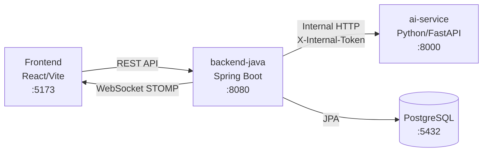

# Restructure ABSA_App → 3-Tier Architecture (backend-java + ai-service + frontend)

## Tổng quan

Hiện tại project có 2 phần: `backend/` (Python/FastAPI — AI inference) và `frontend/` (React/Vite — UI phân tích review đơn lẻ). Mục tiêu là chuyển sang kiến trúc 3 phần rõ ràng:



---

## User Review Required

> [!IMPORTANT]
> **ERD Entities**: Plan tạo 8 entities (User, Shop, Product, Review, SentimentResult, Alert, SyncLog, Report) với quan hệ đúng yêu cầu. Review giả sử dùng quan hệ `@OneToOne` với `SentimentResult` — nếu bạn muốn `OneToMany` (1 review có thể phân tích nhiều lần), cần confirm.

> [!WARNING]
> **Spring Security JWT**: Sẽ dùng `jjwt-api` (io.jsonwebtoken) cho JWT generation/validation, KHÔNG dùng Spring OAuth2 Resource Server (đơn giản hơn cho internal app). Nếu muốn dùng OAuth2 thay, hãy cho biết.

> [!IMPORTANT]
> **SaaS Dashboard Design**: Thư mục này chứa 1 file [App.tsx](file:///d:/02_Workspace/App_NCKH/ABSA_App/frontend/SaaS%20Dashboard%20Design/src/app/App.tsx) (~90KB, 1488 dòng) là bản thiết kế Figma Make — đây chính là UI hoàn chỉnh của dashboard SaaS (Overview, Products, Reviews Feed, Connect, Reports, Settings, Notifications). Plan sẽ **dùng nó làm nguồn tham khảo** để tách thành component-pages cho frontend mới, sau đó **xóa thư mục SaaS Dashboard Design**.

---

## Open Questions

> [!IMPORTANT]
> 1. **Database**: Plan dùng PostgreSQL. Bạn đã có PostgreSQL local hay muốn chỉ dùng H2 in-memory lúc dev?
> 2. **AI Model response**: Inference hiện tại trả `result` với `aspect_sentiments`, `insight`, etc. Backend-java cần map sang `{sentiment, topic, confidenceScore}` — bạn muốn map thế nào? Plan sẽ lấy overall sentiment, topic đầu tiên, và confidence trung bình từ kết quả AI.
> 3. **Frontend routing**: Có muốn dùng `react-router-dom` để có multi-page SPA routing không? (Plan sẽ thêm).

---

## Proposed Changes

### Phase 1: Rename & Refactor ai-service

#### [RENAME] `backend/` → `ai-service/`

Rename folder, giữ nguyên toàn bộ core AI logic.

#### [MODIFY] [main.py](file:///d:/02_Workspace/App_NCKH/ABSA_App/backend/app/main.py)
- Đổi title thành `"AI Service - HIGEN-ABSA"`
- Thêm internal token middleware: kiểm tra `X-Internal-Token` header trên mọi request (trừ `/health`)
- CORS chỉ cho phép origin từ backend-java (không public)

#### [MODIFY] [routes.py](file:///d:/02_Workspace/App_NCKH/ABSA_App/backend/app/api/routes.py)
- **Xóa**: `/predict`, `/predict/batch`, `/api/infer`, `/labels` (public endpoints)
- **Thêm**: `POST /internal/classify` — nhận `{reviewId, content}`, trả `{sentiment, topic, confidenceScore}`
- **Thêm**: `POST /internal/classify-batch` — nhận `{items: [{reviewId, content}, ...]}`, trả list kết quả
- Giữ `/health` cho health check

#### [MODIFY] [schemas.py](file:///d:/02_Workspace/App_NCKH/ABSA_App/backend/app/api/schemas.py)
- Thay schemas cũ bằng: `ClassifyRequest`, `ClassifyBatchRequest`, `ClassifyResponse`

#### [MODIFY] [config.py](file:///d:/02_Workspace/App_NCKH/ABSA_App/backend/app/config.py)
- Thêm `INTERNAL_TOKEN` từ env var

#### [MODIFY] [.env.example](file:///d:/02_Workspace/App_NCKH/ABSA_App/backend/.env.example)
- Thêm `INTERNAL_TOKEN=your-secret-token`

#### [NEW] `ai-service/app/middleware.py`
- `InternalTokenMiddleware`: kiểm tra `X-Internal-Token` trên mọi request trừ `/health`

---

### Phase 2: Create backend-java (Spring Boot 3)

#### [NEW] `backend-java/pom.xml`
- Spring Boot 3.x, Java 17
- Dependencies: Spring Web, Data JPA, Security, Validation, PostgreSQL, Lombok, JJWT, WebSocket

#### [NEW] `backend-java/src/main/resources/application.yml`
- Cấu hình: datasource PostgreSQL, JPA hibernate, JWT secret/expiration, AI service base-url, CORS frontend-url, WebSocket, Scheduled polling interval

#### Package structure: `com.feedbackai.*`

##### Entity Layer
| File | Entity | Quan hệ |
|------|--------|---------|
| `auth/entity/User.java` | User | `@OneToMany → Shop`, `@OneToMany → Report` |
| `shop/entity/Shop.java` | Shop | `@ManyToOne → User`, `@OneToMany → Product`, `@OneToMany → SyncLog` |
| `product/entity/Product.java` | Product | `@ManyToOne → Shop`, `@OneToMany → Review`, `@OneToMany → Alert` |
| `review/entity/Review.java` | Review | `@ManyToOne → Product`, `@OneToOne → SentimentResult` |
| `review/entity/SentimentResult.java` | SentimentResult | `@OneToOne → Review` |
| `alert/entity/Alert.java` | Alert | `@ManyToOne → Product` |
| `shop/entity/SyncLog.java` | SyncLog | `@ManyToOne → Shop` |
| `report/entity/Report.java` | Report | `@ManyToOne → User` |

##### Repository Layer
- JPA repositories cho mỗi entity: `UserRepository`, `ShopRepository`, `ProductRepository`, `ReviewRepository`, `SentimentResultRepository`, `AlertRepository`, `SyncLogRepository`, `ReportRepository`

##### Service + Controller Layer

| Package | Controller Endpoints |
|---------|---------------------|
| `auth` | `POST /api/auth/register`, `POST /api/auth/login`, `GET /api/auth/me` |
| `shop` | `GET /api/shops`, `POST /api/shops`, `GET /api/shops/{id}`, `PUT /api/shops/{id}`, `DELETE /api/shops/{id}` |
| `product` | `GET /api/shops/{shopId}/products`, `POST /api/shops/{shopId}/products`, `GET /api/products/{id}`, `PUT /api/products/{id}`, `DELETE /api/products/{id}` |
| `review` | `GET /api/products/{productId}/reviews`, `GET /api/reviews/{id}`, `GET /api/reviews/recent` (feed), `POST /api/reviews/{id}/classify` (trigger AI single) |
| `alert` | `GET /api/alerts`, `GET /api/products/{productId}/alerts`, `PUT /api/alerts/{id}/read` |
| `report` | `GET /api/reports`, `POST /api/reports/generate`, `GET /api/reports/{id}` |
| `overview` | `GET /api/overview/stats` (dashboard KPIs), `GET /api/overview/trend`, `GET /api/overview/platform-share` |

##### AI Client
- `aiclient/AiServiceClient.java` — dùng `RestTemplate` gọi `POST {ai-service.base-url}/internal/classify` và `/internal/classify-batch`, thêm header `X-Internal-Token`

##### Security
- `config/SecurityConfig.java` — JWT filter chain, whitelist `/api/auth/**`
- `config/JwtTokenProvider.java` — generate/validate JWT
- `config/JwtAuthenticationFilter.java` — OncePerRequestFilter extract Bearer token
- `config/CorsConfig.java` — CORS cho FRONTEND_URL

##### WebSocket
- `config/WebSocketConfig.java` — STOMP endpoint `/ws/notifications`, broker `/topic`
- `notification/NotificationService.java` — push message tới `/topic/alerts`, `/topic/reviews`

##### Scheduler
- `aiclient/ReviewPollingScheduler.java` — `@Scheduled(fixedRateString = "${polling.interval-ms:300000}")` — mô phỏng poll review mới, gọi AI classify batch, lưu SentimentResult, tạo Alert nếu negative spike, push WebSocket notification

##### Config
- `config/AppConfig.java` — RestTemplate bean
- `common/dto/` — shared DTOs, PageResponse, ApiResponse wrapper

---

### Phase 3: Restructure Frontend

#### [DELETE] `frontend/SaaS Dashboard Design/` (toàn bộ)
Nội dung đã được tham khảo & sẽ tách vào codebase chính.

#### Frontend File Structure (mới)

```
frontend/src/
├── main.jsx
├── App.jsx                    ← Router wrapper
├── index.css                  ← Giữ nguyên design system
├── App.css                    ← Global layout
├── assets/
│   └── hero.png, react.svg, vite.svg
├── components/
│   ├── layout/
│   │   ├── Sidebar.jsx + .css
│   │   ├── TopBar.jsx + .css
│   │   └── MainLayout.jsx + .css
│   ├── common/
│   │   ├── SentimentBadge.jsx + .css     (giữ từ cũ)
│   │   ├── PlatformBadge.jsx + .css
│   │   ├── StatCard.jsx + .css
│   │   ├── LoadingSpinner.jsx + .css
│   │   └── EmptyState.jsx + .css
│   └── charts/
│       ├── SentimentTrendChart.jsx
│       ├── PlatformPieChart.jsx
│       └── AspectBarChart.jsx
├── pages/
│   ├── OverviewPage.jsx + .css
│   ├── ProductsPage.jsx + .css
│   ├── ProductDetailPage.jsx + .css
│   ├── ReviewFeedPage.jsx + .css
│   ├── ConnectPage.jsx + .css
│   ├── ReportsPage.jsx + .css
│   ├── SettingsPage.jsx + .css
│   ├── NotificationsPage.jsx + .css
│   ├── LoginPage.jsx + .css
│   └── RegisterPage.jsx + .css
├── services/
│   ├── apiClient.js           ← axios/fetch wrapper, base URL = VITE_API_BASE_URL
│   ├── authService.js         ← login, register, getMe, JWT storage
│   ├── shopService.js
│   ├── productService.js
│   ├── reviewService.js
│   ├── alertService.js
│   ├── reportService.js
│   └── overviewService.js
├── hooks/
│   ├── useAuth.js
│   └── useWebSocket.js
└── context/
    └── AuthContext.jsx
```

#### Các thay đổi chính:
- **Routing**: Thêm `react-router-dom`, `App.jsx` chỉ là `BrowserRouter` + `Routes`
- **Layout**: `MainLayout` wraps sidebar + topbar + outlet (cho authenticated pages)
- **API calls**: Tất cả gọi tới `VITE_API_BASE_URL` (backend-java, mặc định `http://localhost:8080/api`)
- **Auth flow**: `LoginPage` → JWT stored in localStorage → `AuthContext` → protected routes
- **WebSocket**: `useWebSocket` hook kết nối STOMP tới `/ws/notifications` → real-time alert/review push
- **Mock data ban đầu**: Pages sẽ code layout & logic hoàn chỉnh, gọi API service thật. Dữ liệu sẽ phụ thuộc vào backend-java đang chạy

#### [MODIFY] [package.json](file:///d:/02_Workspace/App_NCKH/ABSA_App/frontend/package.json)
- Thêm dependencies: `react-router-dom`, `recharts`, `@stomp/stompjs`, `lucide-react`

#### [NEW] `frontend/.env`
```
VITE_API_BASE_URL=http://localhost:8080/api
VITE_WS_URL=ws://localhost:8080/ws/notifications
```

---

### Phase 4: Docker Compose

#### [NEW] `docker-compose.yml` (root)
```yaml
services:
  postgres:     # Port 5432
  backend-java: # Port 8080, depends_on postgres
  ai-service:   # Port 8000
  frontend:     # Port 5173, depends_on backend-java
```
- Network chung: backend-java gọi `http://ai-service:8000`
- Volumes: PostgreSQL data persist

#### [NEW] `backend-java/Dockerfile`
- Multi-stage build: Maven → JRE 17

#### [NEW] `ai-service/Dockerfile`
- Python 3.11, pip install requirements.txt, copy models

#### [NEW] `frontend/Dockerfile`
- Node 20, build → nginx serve

---

## Cây thư mục cuối cùng (dự kiến)

```
ABSA_App/
├── docker-compose.yml
├── ai-service/                          ← (renamed from backend/)
│   ├── Dockerfile
│   ├── .env.example
│   ├── requirements.txt
│   ├── run.py
│   ├── app/
│   │   ├── __init__.py
│   │   ├── main.py
│   │   ├── config.py
│   │   ├── middleware.py                ← NEW (internal token check)
│   │   ├── api/
│   │   │   ├── __init__.py
│   │   │   ├── routes.py               ← /internal/classify, /internal/classify-batch
│   │   │   └── schemas.py
│   │   ├── core/
│   │   │   ├── __init__.py
│   │   │   ├── inference.py
│   │   │   ├── model_bundle.py
│   │   │   ├── postprocess.py
│   │   │   ├── taxonomy.py
│   │   │   └── text_utils.py
│   │   └── data/
│   │       ├── label_schema.json
│   │       └── taxonomy.json
│   └── models/
│       └── visobert_absa_v8/
│
├── backend-java/                        ← NEW
│   ├── Dockerfile
│   ├── pom.xml
│   └── src/main/
│       ├── java/com/feedbackai/
│       │   ├── FeedbackAiApplication.java
│       │   ├── auth/
│       │   │   ├── entity/User.java
│       │   │   ├── dto/{LoginReq, RegisterReq, AuthResponse, UserDto}.java
│       │   │   ├── repository/UserRepository.java
│       │   │   ├── service/AuthService.java
│       │   │   └── controller/AuthController.java
│       │   ├── shop/
│       │   │   ├── entity/Shop.java
│       │   │   ├── entity/SyncLog.java
│       │   │   ├── dto/ShopDto.java
│       │   │   ├── repository/{ShopRepository, SyncLogRepository}.java
│       │   │   ├── service/ShopService.java
│       │   │   └── controller/ShopController.java
│       │   ├── product/
│       │   │   ├── entity/Product.java
│       │   │   ├── dto/ProductDto.java
│       │   │   ├── repository/ProductRepository.java
│       │   │   ├── service/ProductService.java
│       │   │   └── controller/ProductController.java
│       │   ├── review/
│       │   │   ├── entity/{Review, SentimentResult}.java
│       │   │   ├── dto/{ReviewDto, SentimentResultDto}.java
│       │   │   ├── repository/{ReviewRepository, SentimentResultRepository}.java
│       │   │   ├── service/ReviewService.java
│       │   │   └── controller/ReviewController.java
│       │   ├── alert/
│       │   │   ├── entity/Alert.java
│       │   │   ├── dto/AlertDto.java
│       │   │   ├── repository/AlertRepository.java
│       │   │   ├── service/AlertService.java
│       │   │   └── controller/AlertController.java
│       │   ├── report/
│       │   │   ├── entity/Report.java
│       │   │   ├── dto/ReportDto.java
│       │   │   ├── repository/ReportRepository.java
│       │   │   ├── service/ReportService.java
│       │   │   └── controller/ReportController.java
│       │   ├── aiclient/
│       │   │   ├── AiServiceClient.java
│       │   │   ├── dto/{AiClassifyRequest, AiClassifyResponse, AiBatchRequest}.java
│       │   │   └── ReviewPollingScheduler.java
│       │   ├── notification/
│       │   │   └── NotificationService.java
│       │   ├── config/
│       │   │   ├── SecurityConfig.java
│       │   │   ├── JwtTokenProvider.java
│       │   │   ├── JwtAuthenticationFilter.java
│       │   │   ├── CorsConfig.java
│       │   │   ├── WebSocketConfig.java
│       │   │   └── AppConfig.java
│       │   └── common/
│       │       ├── dto/{ApiResponse, PageResponse}.java
│       │       └── exception/GlobalExceptionHandler.java
│       └── resources/
│           └── application.yml
│
├── frontend/                            ← RESTRUCTURED
│   ├── Dockerfile
│   ├── .env
│   ├── package.json
│   ├── vite.config.js
│   ├── index.html
│   └── src/
│       ├── main.jsx
│       ├── App.jsx
│       ├── index.css
│       ├── App.css
│       ├── assets/
│       ├── components/
│       │   ├── layout/{Sidebar, TopBar, MainLayout}.jsx
│       │   ├── common/{SentimentBadge, PlatformBadge, StatCard, ...}.jsx
│       │   └── charts/{SentimentTrendChart, PlatformPieChart, ...}.jsx
│       ├── pages/
│       │   ├── {Overview, Products, ProductDetail, ReviewFeed}Page.jsx
│       │   ├── {Connect, Reports, Settings, Notifications}Page.jsx
│       │   └── {Login, Register}Page.jsx
│       ├── services/
│       │   ├── apiClient.js
│       │   └── {auth, shop, product, review, alert, report, overview}Service.js
│       ├── hooks/{useAuth, useWebSocket}.js
│       └── context/AuthContext.jsx
│
└── README.md
```

---

## Verification Plan

### Automated Tests
```bash
# ai-service: test internal endpoints
cd ai-service && python -m pytest tests/ -v

# backend-java: compile & verify
cd backend-java && mvn clean compile

# frontend: build check
cd frontend && npm run build
```

### Manual Verification
- `ai-service`: Gửi request tới `/internal/classify` với/không có `X-Internal-Token` → verify middleware chặn unauthorized
- `backend-java`: Start Spring Boot → verify `/api/auth/register`, `/api/auth/login`, JWT flow
- `frontend`: `npm run dev` → verify routing, login page, dashboard layout hiển thị
- Docker Compose: `docker-compose up` → verify 4 services liên thông

---

## Execution Order

1. **ai-service** (rename + refactor routes/middleware) — ~15 files thay đổi
2. **backend-java** (full creation) — ~50+ files mới
3. **frontend** (restructure + new pages/services) — ~40+ files mới/sửa
4. **docker-compose** — 4 files mới (compose + 3 Dockerfiles)
