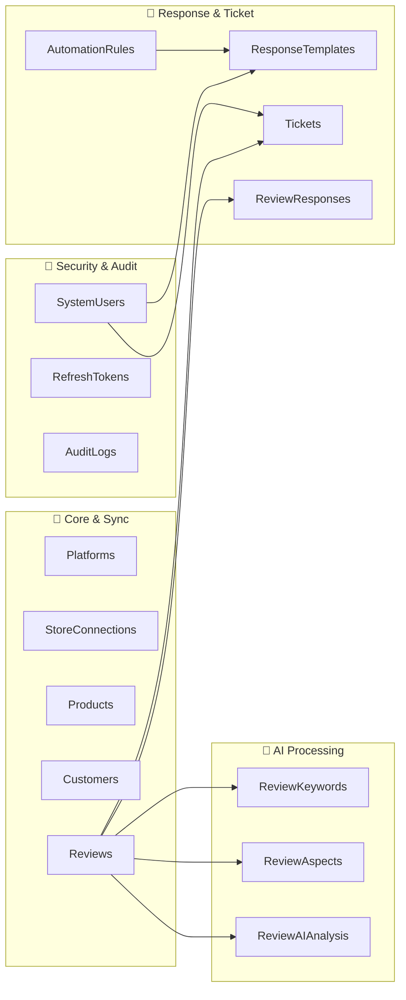
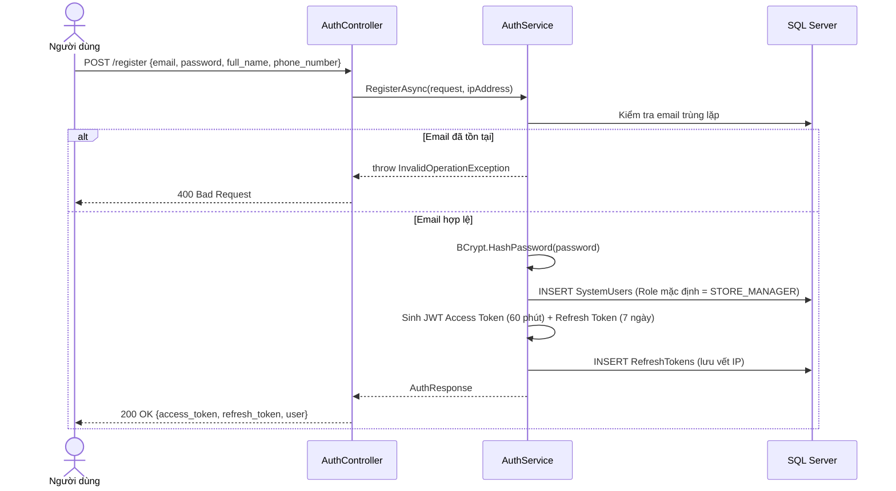
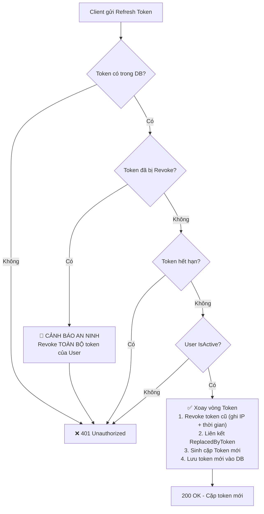
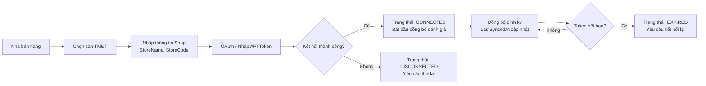
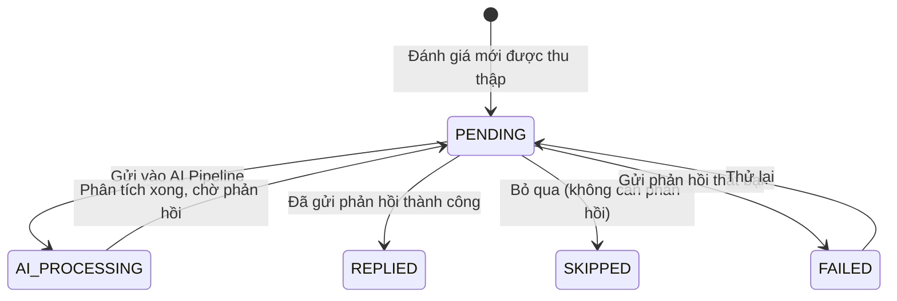
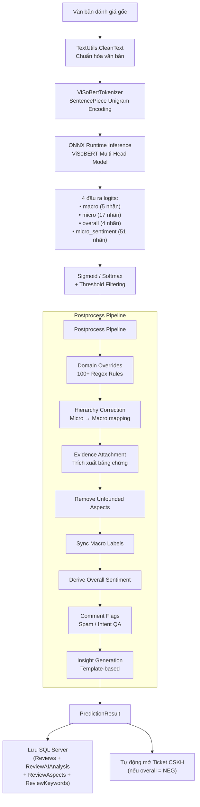
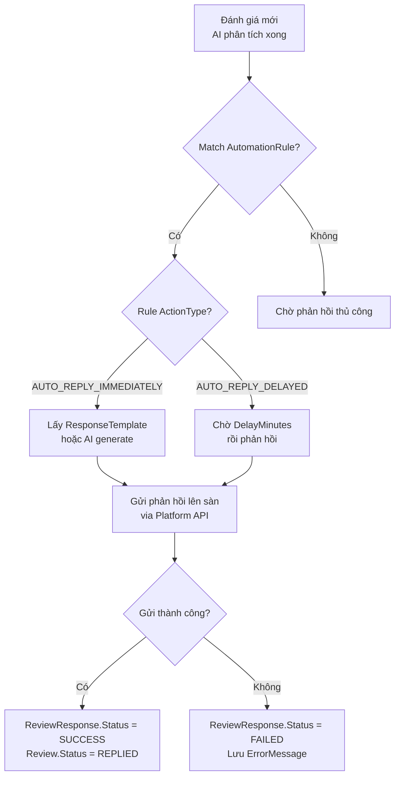
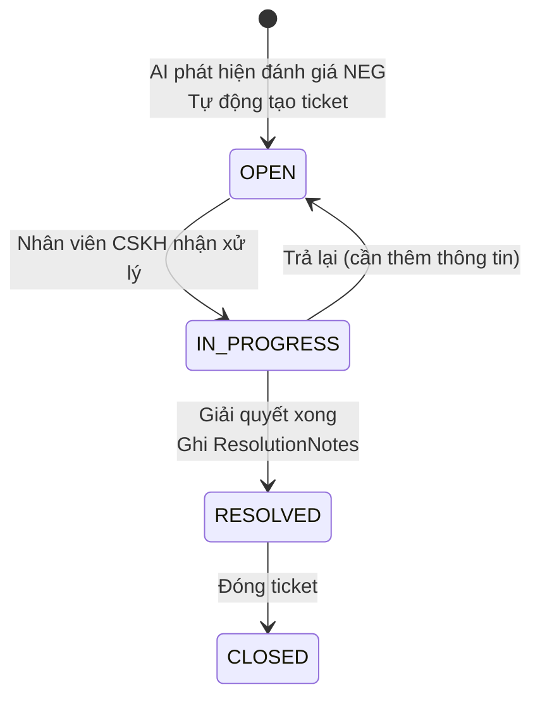

# HIGEN-ABSA — Tài Liệu Nghiệp Vụ Chi Tiết

> **Dự án**: HIGEN-ABSA (Hierarchical Insight Generation for E-commerce Natural Language — Aspect-Based Sentiment Analysis)
> **Phiên bản**: 1.0 · Cập nhật: 22/08/2026
> **Stack**: .NET 10 (C#) · SQL Server · React 19 · Vite 6 · ONNX Runtime

---

## Mục lục

1. [Tổng quan Kiến trúc Nghiệp vụ](#1-tổng-quan-kiến-trúc-nghiệp-vụ)
2. [NV1 — Xác thực & Phân quyền (Authentication & RBAC)](#2-nv1--xác-thực--phân-quyền)
3. [NV2 — Quản lý Gian hàng Đa sàn TMĐT](#3-nv2--quản-lý-gian-hàng-đa-sàn-tmđt)
4. [NV3 — Quản lý Sản phẩm & Khách hàng](#4-nv3--quản-lý-sản-phẩm--khách-hàng)
5. [NV4 — Thu thập & Đồng bộ Đánh giá](#5-nv4--thu-thập--đồng-bộ-đánh-giá)
6. [NV5 — Phân tích Cảm xúc AI (ABSA Engine)](#6-nv5--phân-tích-cảm-xúc-ai-absa-engine)
7. [NV6 — Quản lý Phản hồi & Tự động hóa](#7-nv6--quản-lý-phản-hồi--tự-động-hóa)
8. [NV7 — Hệ thống Ticket CSKH](#8-nv7--hệ-thống-ticket-cskh)
9. [NV8 — Dashboard Tổng quan & Báo cáo](#9-nv8--dashboard-tổng-quan--báo-cáo)
10. [NV9 — Nhật ký Hệ thống (Audit Log)](#10-nv9--nhật-ký-hệ-thống-audit-log)
11. [Đề xuất Nghiệp vụ Nâng cao](#11-đề-xuất-nghiệp-vụ-nâng-cao)
12. [Ma trận Trạng thái Triển khai](#12-ma-trận-trạng-thái-triển-khai)

---

## 1. Tổng quan Kiến trúc Nghiệp vụ

Hệ thống HIGEN-ABSA được tổ chức thành **9 phân khu nghiệp vụ** (Business Domain), mỗi phân khu tương ứng với một nhóm Entity/bảng CSDL trong SQL Server:



| Phân khu | Số bảng | Entity Files |
| :--- | :---: | :--- |
| Security & Audit | 3 | `SecurityEntities.cs`, `RefreshToken.cs` |
| Core & Sync | 5 | `CoreEntities.cs` |
| AI Processing | 3 | `AiEntities.cs` |
| Response & Ticket | 4 | `ResponseEntities.cs` |
| **Tổng** | **15** | |

---

## 2. NV1 — Xác thực & Phân quyền

> **Trạng thái**: ✅ Đã triển khai đầy đủ (Backend + Frontend)

### 2.1. Mô tả Nghiệp vụ

Hệ thống quản lý tài khoản người dùng nội bộ (nhân viên Shop, quản lý, nhân viên CSKH) với cơ chế xác thực JWT kép (Access Token + Refresh Token Rotation) và phân quyền theo vai trò (RBAC).

### 2.2. Các Vai trò (Roles)

| Vai trò | Mã Code | Quyền hạn dự kiến |
| :--- | :--- | :--- |
| Quản trị viên | `ADMIN` | Toàn quyền: quản lý user, cấu hình hệ thống, xem toàn bộ dữ liệu |
| Quản lý gian hàng | `STORE_MANAGER` | Quản lý shop, sản phẩm, xem đánh giá, cấu hình quy tắc phản hồi |
| Nhân viên CSKH | `CSKH_STAFF` | Xử lý ticket khiếu nại, trả lời đánh giá thủ công |

### 2.3. Luồng Nghiệp vụ Chi tiết

#### 2.3.1. Đăng ký tài khoản (`POST /api/v1/auth/register`)



**Quy tắc nghiệp vụ:**
- Email được chuẩn hóa `ToLower().Trim()` trước khi lưu
- Mật khẩu được băm bằng **BCrypt** với Salt tự động, không bao giờ lưu dạng plain text
- Vai trò mặc định: `STORE_MANAGER` nếu không chỉ định
- Ngay sau đăng ký thành công → tự động cấp cặp token để đăng nhập ngay

#### 2.3.2. Đăng nhập (`POST /api/v1/auth/login`)

**Quy tắc nghiệp vụ:**
- So khớp email (case-insensitive) và kiểm tra trạng thái `IsActive`
- Xác thực mật khẩu bằng `BCrypt.Verify()`
- Thông báo lỗi chung chung ("Invalid email or password") → chống Account Enumeration Attack
- Cấp phát cặp Access Token + Refresh Token mới, lưu vết IP vào CSDL

#### 2.3.3. Làm mới Token (`POST /api/v1/auth/refresh-token`)

> [!IMPORTANT]
> Đây là nghiệp vụ an ninh quan trọng nhất — kết hợp **Refresh Token Rotation** + **Reuse Detection**.



**Cơ chế bảo vệ:**
- **Token Rotation**: Mỗi lần refresh, token cũ bị hủy ngay lập tức, token mới được liên kết qua `ReplacedByToken`
- **Reuse Detection**: Nếu token đã bị hủy trước đó mà vẫn được gửi lại → phát hiện kẻ tấn công đã đánh cắp token → gọi `RevokeAllUserTokensAsync()` để hủy toàn bộ session trên mọi thiết bị

#### 2.3.4. Đăng xuất (`POST /api/v1/auth/logout`)

- Thu hồi Refresh Token hiện tại (`IsRevoked = true`)
- Ghi lại `RevokedAt` và `RevokedByIp` phục vụ audit trail
- Frontend tự xóa token khỏi `localStorage`

#### 2.3.5. Xem thông tin cá nhân (`GET /api/v1/auth/me`)

- Yêu cầu `[Authorize]` — phải gửi kèm `Authorization: Bearer <AccessToken>`
- Trích xuất `UserId` từ JWT Claim `NameIdentifier`
- Trả về DTO `UserProfileDto` (không bao gồm `PasswordHash`)

### 2.4. Bảng CSDL liên quan

| Bảng | Mục đích |
| :--- | :--- |
| `SystemUsers` | Tài khoản người dùng: Email, PasswordHash (BCrypt), Role, IsActive |
| `RefreshTokens` | Lưu trữ Refresh Token: Token, ExpiresAt, CreatedByIp, IsRevoked, RevokedByIp, ReplacedByToken |

### 2.5. Đề xuất Nâng cao

| # | Tính năng | Mức độ | Mô tả |
| :--- | :--- | :--- | :--- |
| NV1-A | Quản lý User (CRUD) | 🔴 Quan trọng | Admin có thể tạo/sửa/khóa/xóa tài khoản user, đổi role |
| NV1-B | Đổi mật khẩu | 🔴 Quan trọng | User tự đổi mật khẩu (xác nhận mật khẩu cũ trước) |
| NV1-C | Quên mật khẩu (Email OTP) | 🟡 Nên có | Gửi OTP qua email để reset mật khẩu |
| NV1-D | Two-Factor Authentication (2FA) | 🟢 Nâng cao | Xác thực 2 bước qua TOTP (Google Authenticator) |
| NV1-E | Session Management | 🟡 Nên có | Xem danh sách session đang hoạt động, thu hồi session từ xa |
| NV1-F | Rate Limiting Login | 🔴 Quan trọng | Giới hạn số lần đăng nhập sai (ví dụ: 5 lần/15 phút) để chống brute-force |
| NV1-G | Phân quyền chi tiết (Permission) | 🟡 Nên có | Bổ sung bảng `Permissions` + `RolePermissions` cho phân quyền mịn hơn RBAC thô |

---

## 3. NV2 — Quản lý Gian hàng Đa sàn TMĐT

> **Trạng thái**: 🟡 Entity đã khai báo, chưa có API CRUD và UI quản lý

### 3.1. Mô tả Nghiệp vụ

Cho phép nhà bán hàng kết nối nhiều gian hàng từ các sàn TMĐT (Shopee, Lazada, Tiki, TikTok Shop) vào hệ thống. Mỗi gian hàng lưu thông tin kết nối API sàn, trạng thái đồng bộ và token OAuth.

### 3.2. Sàn TMĐT được hỗ trợ (Seed Data)

| ID | Mã Code | Tên hiển thị | Trạng thái |
| :--- | :--- | :--- | :--- |
| 1 | `SHOPEE` | Shopee Việt Nam | ✅ Active |
| 2 | `LAZADA` | Lazada Việt Nam | ✅ Active |
| 3 | `TIKI` | Tiki | ✅ Active |
| 4 | `TIKTOK_SHOP` | TikTok Shop Việt Nam | ✅ Active |

### 3.3. Luồng Nghiệp vụ



### 3.4. Bảng CSDL

| Bảng | Trường quan trọng |
| :--- | :--- |
| `Platforms` | Code, Name, ApiBaseUrl, IsActive |
| `StoreConnections` | PlatformId, StoreName, StoreCodeOnPlatform, AccessToken, RefreshToken, Status (`CONNECTED` / `EXPIRED` / `DISCONNECTED`), LastSyncedAt |

### 3.5. API Endpoints cần triển khai

| Method | Endpoint | Mô tả |
| :--- | :--- | :--- |
| `GET` | `/api/v1/platforms` | Danh sách sàn TMĐT hỗ trợ |
| `GET` | `/api/v1/stores` | Danh sách gian hàng đã kết nối của user |
| `POST` | `/api/v1/stores` | Kết nối gian hàng mới |
| `PUT` | `/api/v1/stores/{id}` | Cập nhật thông tin gian hàng |
| `DELETE` | `/api/v1/stores/{id}` | Ngắt kết nối gian hàng |
| `POST` | `/api/v1/stores/{id}/sync` | Kích hoạt đồng bộ thủ công |

### 3.6. Đề xuất Nâng cao

| # | Tính năng | Mức độ | Mô tả |
| :--- | :--- | :--- | :--- |
| NV2-A | OAuth Integration thực tế | 🟡 Nên có | Tích hợp OAuth flow thực tế với API Shopee, Lazada |
| NV2-B | Scheduled Sync (Cron Job) | 🔴 Quan trọng | Đồng bộ tự động đánh giá mới theo chu kỳ (mỗi 15 phút / 1 giờ) |
| NV2-C | Webhook Listener | 🟢 Nâng cao | Nhận thông báo real-time khi có đánh giá mới từ sàn qua webhook |
| NV2-D | Multi-tenant | 🟢 Nâng cao | Mỗi user/tổ chức chỉ thấy dữ liệu gian hàng của mình |

---

## 4. NV3 — Quản lý Sản phẩm & Khách hàng

> **Trạng thái**: 🟡 Entity đã khai báo, chưa có API CRUD và UI

### 4.1. Sản phẩm (Products)

**Mô tả**: Lưu trữ thông tin sản phẩm được đồng bộ từ các sàn TMĐT, phục vụ liên kết đánh giá với sản phẩm cụ thể để phân tích theo từng SKU.

| Trường | Mô tả |
| :--- | :--- |
| `PlatformProductId` | Mã sản phẩm trên sàn (Shopee item_id, Lazada sku_id...) |
| `Sku` | Mã SKU nội bộ của nhà bán hàng |
| `Name` | Tên sản phẩm |
| `ImageUrl` | Ảnh đại diện sản phẩm |
| `CategoryName` | Danh mục sản phẩm |

**API cần triển khai**:
- `GET /api/v1/products` — Danh sách sản phẩm (phân trang, lọc theo store, search theo tên)
- `GET /api/v1/products/{id}` — Chi tiết sản phẩm + thống kê đánh giá
- `GET /api/v1/products/{id}/reviews` — Đánh giá của sản phẩm
- `GET /api/v1/products/{id}/sentiment-summary` — Tổng hợp cảm xúc theo khía cạnh

### 4.2. Khách hàng (Customers)

**Mô tả**: Lưu thông tin khách hàng đã để lại đánh giá, hỗ trợ phân tích hành vi và phát hiện rủi ro.

| Trường | Mô tả |
| :--- | :--- |
| `PlatformUserId` | Mã user trên sàn TMĐT |
| `DisplayName` | Tên hiển thị |
| `TotalReviewsCount` | Tổng số đánh giá đã viết |
| `RiskLevel` | Mức độ rủi ro: `NORMAL`, `POTENTIAL_BOMMER`, `VIP` |

> [!NOTE]
> Trường `RiskLevel` hỗ trợ phát hiện "review bomber" — khách hàng có dấu hiệu đánh giá tiêu cực hàng loạt hoặc đánh giá nghi ngờ spam.

**API cần triển khai**:
- `GET /api/v1/customers` — Danh sách khách hàng (phân trang, lọc theo risk level)
- `GET /api/v1/customers/{id}` — Chi tiết khách hàng + lịch sử đánh giá
- `PUT /api/v1/customers/{id}/risk-level` — Cập nhật mức rủi ro thủ công

---

## 5. NV4 — Thu thập & Đồng bộ Đánh giá

> **Trạng thái**: 🟡 Entity + lưu trữ khi predict đã hoạt động; chưa có đồng bộ thực tế từ sàn

### 5.1. Mô tả Nghiệp vụ

Đánh giá (Review) là đơn vị dữ liệu cốt lõi của toàn hệ thống. Mỗi đánh giá được thu thập từ sàn TMĐT hoặc nhập thủ công, sau đó đi qua pipeline AI để phân tích cảm xúc.

### 5.2. Vòng đời Đánh giá (Review Lifecycle)



### 5.3. Trạng thái Đánh giá

| Status | Mô tả |
| :--- | :--- |
| `PENDING` | Mới thu thập, chờ xử lý / phản hồi |
| `REPLIED` | Đã phản hồi thành công lên sàn |
| `FAILED` | Phản hồi thất bại (lỗi API sàn) |
| `SKIPPED` | Không cần phản hồi (spam, noise...) |

### 5.4. Bảng CSDL

| Trường | Mô tả |
| :--- | :--- |
| `PlatformReviewId` | Mã đánh giá trên sàn (unique) |
| `OrderIdOnPlatform` | Mã đơn hàng liên quan |
| `Rating` | Số sao (1–5) |
| `CommentText` | Nội dung đánh giá |
| `MediaUrlsJson` | JSON array chứa URL hình ảnh/video đính kèm |
| `ReviewCreatedAt` | Thời điểm khách viết đánh giá |
| `SyncedAt` | Thời điểm hệ thống thu thập |

### 5.5. API Endpoints cần triển khai

| Method | Endpoint | Mô tả |
| :--- | :--- | :--- |
| `GET` | `/api/v1/reviews` | Danh sách đánh giá (phân trang, lọc theo store/product/rating/sentiment/status) |
| `GET` | `/api/v1/reviews/{id}` | Chi tiết đánh giá + kết quả AI + phản hồi |
| `PUT` | `/api/v1/reviews/{id}/status` | Cập nhật trạng thái (SKIPPED, PENDING...) |
| `POST` | `/api/v1/reviews/import` | Import CSV/Excel đánh giá thủ công |

---

## 6. NV5 — Phân tích Cảm xúc AI (ABSA Engine)

> **Trạng thái**: ✅ Đã triển khai đầy đủ (Backend AI Pipeline)

### 6.1. Mô tả Nghiệp vụ

Đây là **lõi AI cốt lõi** của hệ thống. Mỗi đánh giá khách hàng được phân tích qua mô hình **ViSoBERT** (Vietnamese Social BERT) đã export sang ONNX, kết hợp với hệ thống quy tắc ngôn ngữ chuyên biệt cho thị trường TMĐT Việt Nam.

### 6.2. Pipeline Xử lý



### 6.3. Hệ thống Phân loại Phân cấp (Hierarchical Taxonomy)

#### Macro Categories (5 thể loại lớn)

| Macro | Tiếng Việt | Micro Aspects thuộc nhóm |
| :--- | :--- | :--- |
| `PRODUCT` | Sản phẩm | Appearance_Design, Material_BuildQuality, Performance_Functionality, Usability_Experience, Authenticity_Packaging |
| `SHIPPING` | Vận chuyển | Delivery_Speed, External_Packaging, Courier_Attitude, Shipping_Fee |
| `SERVICE` | Dịch vụ | Response_Time, Consulting_Attitude, AfterSales_Complaint |
| `PRICE` | Giá cả | Price_Promotion, Price_Performance_Ratio |
| `OTHERS` | Khác | Overall_Sentiment, Spam_Noise, Intent_QA |

#### Sentiment Labels

| Nhãn | Ý nghĩa |
| :--- | :--- |
| `POS` | Tích cực |
| `NEU` | Trung tính |
| `NEG` | Tiêu cực |
| `MIXED` | Hỗn hợp (chỉ áp dụng cho Overall Sentiment) |

### 6.4. Domain Overrides (Quy tắc Ghi đè Ngôn ngữ)

Hệ thống sử dụng **100+ Regex Rules** chuyên biệt cho ngôn ngữ TMĐT Việt Nam để bổ sung hoặc ghi đè kết quả mô hình AI khi phát hiện các pattern ngôn ngữ đặc thù:

| Nhóm Rule | Ví dụ Pattern | Micro Aspect | Sentiment |
| :--- | :--- | :--- | :--- |
| Tính chính hãng | "seal bị bóc", "hàng nhái", "fake" | Authenticity_Packaging | NEG |
| Tính chính hãng (tích cực) | "seal còn nguyên", "chính hãng" | Authenticity_Packaging | POS |
| Hiệu năng | "rất ngon", "chạy êm", "hút mạnh" | Performance_Functionality | POS |
| Vận chuyển | "giao hàng chậm", "ship lâu" | Delivery_Speed | NEG |
| Giá cả | "mua sale", "giá mềm", "voucher" | Price_Promotion | POS |
| Spam | "nhận xu", "lấy xu", "đủ ký tự" | Spam_Noise | NEU |
| Hỏi đáp | "shop ơi", "đổi được không", "?" | Intent_QA | NEU |

### 6.5. Insight Generation (Sinh Insight Tự động)

Cho mỗi đánh giá, hệ thống tự động tạo 4 loại Insight bằng template:

| Loại | Mô tả | Ví dụ |
| :--- | :--- | :--- |
| **Customer Insight** | Tóm tắt cảm nhận khách hàng | "Khách hàng hài lòng với hình thức/mẫu mã sản phẩm, nhưng chưa hài lòng về tốc độ giao hàng." |
| **Root Cause** | Nguyên nhân cốt lõi | "Vấn đề chính nằm ở tốc độ giao hàng." |
| **Business Recommendation** | Khuyến nghị cải thiện | "Nên theo dõi SLA vận chuyển và phối hợp đơn vị giao hàng để giảm chậm trễ." |
| **Suggested Seller Response** | Mẫu phản hồi gợi ý | "Shop xin lỗi vì trải nghiệm giao hàng chưa tốt. Shop sẽ kiểm tra lại..." |

### 6.6. Bảng CSDL

| Bảng | Mục đích |
| :--- | :--- |
| `ReviewAIAnalysis` | Cảm xúc tổng quan, Insight, Model Version, Spam/QA flags |
| `ReviewAspects` | Chi tiết từng khía cạnh: Macro, Micro, Sentiment, Score, Evidence (start/end), OverrideReason |
| `ReviewKeywords` | Từ khóa quan trọng trích xuất từ đánh giá |

### 6.7. API Endpoints hiện có

| Method | Endpoint | Mô tả |
| :--- | :--- | :--- |
| `GET` | `/health` | Kiểm tra trạng thái server, model ONNX, DB |
| `GET` | `/labels` | Lấy danh sách nhãn Macro, Micro, Sentiment + ngưỡng |
| `POST` | `/predict` | Phân tích 1 đánh giá đơn lẻ (tự động lưu DB) |
| `POST` | `/predict/batch` | Phân tích hàng loạt đánh giá |
| `POST` | `/api/infer` | Legacy endpoint tương thích cũ |

### 6.8. Đề xuất Nâng cao

| # | Tính năng | Mức độ | Mô tả |
| :--- | :--- | :--- | :--- |
| NV5-A | Human-in-the-Loop Correction | 🟡 Nên có | Cho phép user sửa kết quả AI (sentiment, aspect) → feedback loop để fine-tune model |
| NV5-B | Confidence Score Filtering | 🟡 Nên có | Cho phép user thiết lập ngưỡng tin cậy tối thiểu để lọc kết quả |
| NV5-C | Multi-language Support | 🟢 Nâng cao | Hỗ trợ phân tích đánh giá tiếng Anh (thị trường cross-border) |
| NV5-D | LLM-powered Insight | 🟢 Nâng cao | Kết hợp GPT/Gemini để sinh insight và phản hồi tự nhiên hơn template |

---

## 7. NV6 — Quản lý Phản hồi & Tự động hóa

> **Trạng thái**: 🟡 Entity đã khai báo đầy đủ, chưa có API và UI

### 7.1. Mô tả Nghiệp vụ

Hệ thống cho phép nhà bán hàng tạo mẫu phản hồi (template) và cấu hình quy tắc tự động phản hồi dựa trên kết quả phân tích AI. Khi có đánh giá mới, hệ thống tự động match quy tắc và gửi phản hồi lên sàn TMĐT.

### 7.2. Luồng Phản hồi Tự động



### 7.3. Response Template (Mẫu phản hồi)

| Trường | Mô tả |
| :--- | :--- |
| `Title` | Tên mẫu ("Cảm ơn đánh giá 5 sao") |
| `TargetRating` | Áp dụng cho rating cụ thể (null = tất cả) |
| `TargetSentiment` | Áp dụng cho sentiment cụ thể (POS/NEU/NEG) |
| `TargetAspect` | Áp dụng cho aspect cụ thể (Delivery_Speed...) |
| `ContentTemplate` | Nội dung mẫu, hỗ trợ biến thay thế `{customer_name}`, `{product_name}`... |

### 7.4. Automation Rule (Quy tắc tự động)

| Trường | Mô tả |
| :--- | :--- |
| `RuleName` | Tên quy tắc ("Tự động reply 5 sao") |
| `MinRating` / `MaxRating` | Khoảng rating áp dụng (1–5) |
| `ApplySentimentsJson` | JSON array sentiment áp dụng `["POS", "NEU"]` |
| `ActionType` | `AUTO_REPLY_IMMEDIATELY` hoặc `AUTO_REPLY_DELAYED` |
| `DelayMinutes` | Thời gian trì hoãn trước khi gửi |
| `UseAiGenerative` | Sử dụng AI sinh phản hồi thay vì template |
| `IsEnabled` | Bật/tắt quy tắc |

### 7.5. API Endpoints cần triển khai

| Method | Endpoint | Mô tả |
| :--- | :--- | :--- |
| `GET` | `/api/v1/templates` | Danh sách mẫu phản hồi |
| `POST` | `/api/v1/templates` | Tạo mẫu mới |
| `PUT` | `/api/v1/templates/{id}` | Sửa mẫu |
| `DELETE` | `/api/v1/templates/{id}` | Xóa mẫu |
| `GET` | `/api/v1/automation-rules` | Danh sách quy tắc tự động |
| `POST` | `/api/v1/automation-rules` | Tạo quy tắc mới |
| `PUT` | `/api/v1/automation-rules/{id}` | Sửa quy tắc |
| `PUT` | `/api/v1/automation-rules/{id}/toggle` | Bật/tắt quy tắc |
| `POST` | `/api/v1/reviews/{id}/respond` | Gửi phản hồi thủ công |
| `GET` | `/api/v1/reviews/{id}/responses` | Lịch sử phản hồi của đánh giá |

---

## 8. NV7 — Hệ thống Ticket CSKH

> **Trạng thái**: 🟡 Entity đã khai báo + auto-create khi NEG, chưa có API quản lý và UI

### 8.1. Mô tả Nghiệp vụ

Khi AI phát hiện đánh giá có cảm xúc tổng quan là **tiêu cực (NEG)**, hệ thống tự động tạo Ticket khiếu nại để nhân viên CSKH xử lý. Ticket có thể được gán cho nhân viên cụ thể, theo dõi tiến độ và ghi nhận kết quả giải quyết.

### 8.2. Vòng đời Ticket



### 8.3. Mức độ ưu tiên

| Priority | Điều kiện gợi ý |
| :--- | :--- |
| `URGENT` | Rating 1 sao + nhiều aspect NEG + khách VIP |
| `HIGH` | Rating 1–2 sao hoặc Overall NEG (mặc định khi auto-create) |
| `MEDIUM` | Rating 3 sao + có aspect NEG |
| `LOW` | Đánh giá NEU nhưng có aspect nhỏ NEG |

### 8.4. Bảng CSDL

| Trường | Mô tả |
| :--- | :--- |
| `ReviewId` | Liên kết đánh giá gốc |
| `CustomerId` | Khách hàng khiếu nại |
| `AssignedToUserId` | Nhân viên CSKH được gán |
| `Priority` | `LOW` / `MEDIUM` / `HIGH` / `URGENT` |
| `Status` | `OPEN` / `IN_PROGRESS` / `RESOLVED` / `CLOSED` |
| `ResolutionNotes` | Ghi chú giải quyết |
| `ResolvedAt` | Thời điểm giải quyết |

### 8.5. API Endpoints cần triển khai

| Method | Endpoint | Mô tả |
| :--- | :--- | :--- |
| `GET` | `/api/v1/tickets` | Danh sách ticket (phân trang, lọc status/priority/assigned) |
| `GET` | `/api/v1/tickets/{id}` | Chi tiết ticket + đánh giá + kết quả AI |
| `PUT` | `/api/v1/tickets/{id}/assign` | Gán ticket cho nhân viên |
| `PUT` | `/api/v1/tickets/{id}/status` | Cập nhật trạng thái |
| `PUT` | `/api/v1/tickets/{id}/resolve` | Giải quyết ticket (kèm ResolutionNotes) |
| `GET` | `/api/v1/tickets/stats` | Thống kê ticket theo status/priority/nhân viên |

### 8.6. Đề xuất Nâng cao

| # | Tính năng | Mức độ | Mô tả |
| :--- | :--- | :--- | :--- |
| NV7-A | Auto-assign theo Round Robin | 🟡 Nên có | Tự động phân công ticket cho nhân viên CSKH online theo vòng tròn |
| NV7-B | SLA Tracking | 🟢 Nâng cao | Theo dõi thời gian phản hồi trung bình, cảnh báo khi vượt SLA |
| NV7-C | Escalation Rules | 🟢 Nâng cao | Tự động nâng Priority nếu ticket quá hạn |
| NV7-D | Comment Thread | 🟡 Nên có | Cho phép nhân viên trao đổi nội bộ trên ticket |

---

## 9. NV8 — Dashboard Tổng quan & Báo cáo

> **Trạng thái**: 🟡 Frontend Overview với dữ liệu mock, chưa kết nối API thực

### 9.1. Mô tả Nghiệp vụ

Dashboard là giao diện trung tâm giúp nhà bán hàng nắm bắt tình hình đánh giá trên toàn bộ gian hàng đa sàn trong thời gian thực.

### 9.2. Các Widget/KPI hiện có trên UI

| Widget | Dữ liệu | Trạng thái |
| :--- | :--- | :--- |
| Phản hồi hôm nay | Tổng đánh giá ngày, so sánh % hôm qua | 🟡 Mock data |
| Tỷ lệ tích cực | % đánh giá POS, so sánh tuần trước | 🟡 Mock data |
| Sản phẩm theo dõi | Tổng product đang active | 🟡 Mock data |
| Shop đã kết nối | Số lượng StoreConnection | 🟡 Mock data |
| Xu hướng phản hồi | Line Chart 7 ngày (POS/NEU/NEG) | 🟡 Mock data |
| Phân bổ theo sàn | Pie Chart tỷ lệ đánh giá theo platform | 🟡 Mock data |
| Phản hồi tiêu cực tăng đột biến | Sản phẩm có spike NEG | 🟡 Mock data |
| Phản hồi mới nhất (Live Feed) | Real-time stream đánh giá mới | 🟡 Mock data |

### 9.3. API Endpoints cần triển khai

| Method | Endpoint | Mô tả |
| :--- | :--- | :--- |
| `GET` | `/api/v1/dashboard/kpi` | KPI tổng quan (tổng reviews, % POS/NEU/NEG, so sánh kỳ trước) |
| `GET` | `/api/v1/dashboard/sentiment-trend` | Xu hướng cảm xúc theo ngày/tuần/tháng |
| `GET` | `/api/v1/dashboard/platform-distribution` | Phân bổ đánh giá theo sàn |
| `GET` | `/api/v1/dashboard/aspect-heatmap` | Heatmap cảm xúc theo micro aspect |
| `GET` | `/api/v1/dashboard/negative-spikes` | Sản phẩm có spike đánh giá tiêu cực |
| `GET` | `/api/v1/dashboard/recent-reviews` | Stream đánh giá mới nhất |
| `GET` | `/api/v1/reports/export` | Export báo cáo Excel/PDF |

### 9.4. Đề xuất Nâng cao

| # | Tính năng | Mức độ | Mô tả |
| :--- | :--- | :--- | :--- |
| NV8-A | Real-time WebSocket | 🟡 Nên có | Push đánh giá mới lên Dashboard qua WebSocket/SignalR thay vì polling |
| NV8-B | Custom Date Range | 🔴 Quan trọng | Cho phép user chọn khoảng thời gian phân tích tùy ý |
| NV8-C | Aspect Heatmap | 🟡 Nên có | Bảng nhiệt (heatmap) theo micro aspect × sentiment |
| NV8-D | Competitor Benchmarking | 🟢 Nâng cao | So sánh cảm xúc sản phẩm của mình với đối thủ cùng danh mục |
| NV8-E | Scheduled Email Report | 🟢 Nâng cao | Tự động gửi báo cáo tóm tắt hàng tuần qua email |
| NV8-F | Word Cloud | 🟡 Nên có | Đám mây từ khóa từ bảng ReviewKeywords |

---

## 10. NV9 — Nhật ký Hệ thống (Audit Log)

> **Trạng thái**: 🟡 Entity đã khai báo, chưa có cơ chế ghi log tự động

### 10.1. Mô tả Nghiệp vụ

Ghi lại mọi thao tác quan trọng trong hệ thống để phục vụ kiểm toán, truy vết sự cố và tuân thủ quy định nội bộ.

### 10.2. Bảng CSDL

| Trường | Mô tả |
| :--- | :--- |
| `UserId` | Người thực hiện (nullable — hệ thống tự động) |
| `Action` | Loại hành động: `REPLY_REVIEW`, `UPDATE_RULE`, `RESOLVE_TICKET`, `LOGIN`, `REGISTER`... |
| `EntityName` | Tên entity bị tác động: `Review`, `Ticket`, `AutomationRule`... |
| `EntityId` | ID của entity bị tác động |
| `OldValuesJson` | Giá trị cũ (JSON) |
| `NewValuesJson` | Giá trị mới (JSON) |
| `IpAddress` | Địa chỉ IP |

### 10.3. Cần triển khai

- **Middleware/Interceptor** ghi log tự động cho mọi thao tác CUD (Create/Update/Delete)
- API `GET /api/v1/audit-logs` cho Admin xem nhật ký (phân trang, lọc theo action/user/entity/thời gian)

---

## 11. Đề xuất Nghiệp vụ Nâng cao

Ngoài các đề xuất đã liệt kê trong từng phân khu, dưới đây là các tính năng cross-domain nâng cao:

### 11.1. Thông báo (Notification System)

| Tính năng | Mô tả |
| :--- | :--- |
| In-app Notification | Bell icon + dropdown danh sách thông báo mới |
| Push Notification | Gửi thông báo browser push khi có đánh giá NEG mới |
| Email Alert | Gửi email khi có spike đánh giá tiêu cực hoặc ticket URGENT |
| Notification Preferences | User tự cấu hình loại thông báo muốn nhận |

### 11.2. Phân tích Nâng cao (Advanced Analytics)

| Tính năng | Mô tả |
| :--- | :--- |
| Sentiment Trend Comparison | So sánh xu hướng cảm xúc giữa các sản phẩm/gian hàng |
| Aspect Drill-down | Click vào aspect → xem tất cả đánh giá liên quan |
| Customer Journey Analysis | Theo dõi lịch sử đánh giá của 1 khách hàng qua thời gian |
| Keyword Trend | Phân tích từ khóa hot theo thời gian (rising/declining) |
| Anomaly Detection | Tự động phát hiện bất thường (spike đánh giá, thay đổi sentiment đột ngột) |

### 11.3. Tích hợp Bên ngoài (External Integration)

| Tính năng | Mô tả |
| :--- | :--- |
| Zalo/Telegram Bot | Gửi thông báo tức thời qua bot chat khi có đánh giá NEG |
| Google Sheets Export | Xuất dữ liệu phân tích lên Google Sheets tự động |
| Zapier/n8n Webhook | Trigger workflow bên ngoài khi có sự kiện (đánh giá mới, ticket mới) |
| LLM API Integration | Kết nối GPT/Gemini để sinh phản hồi tự động chất lượng cao |

### 11.4. Quản lý Cấu hình Hệ thống

| Tính năng | Mô tả |
| :--- | :--- |
| Dynamic Threshold | Cho phép Admin điều chỉnh ngưỡng phân loại sentiment/aspect qua UI |
| Model Version Management | Quản lý nhiều phiên bản model AI, A/B testing |
| Feature Flags | Bật/tắt tính năng theo môi trường (dev/staging/prod) |

---

## 12. Ma trận Trạng thái Triển khai

| Nghiệp vụ | Backend Entity | Backend API | Frontend UI | Trạng thái tổng |
| :--- | :---: | :---: | :---: | :--- |
| NV1 — Auth & RBAC | ✅ | ✅ | ✅ | ✅ **Hoàn thiện** |
| NV2 — Gian hàng Đa sàn | ✅ | ❌ | ❌ | 🟡 Cần API + UI |
| NV3 — Sản phẩm & Khách hàng | ✅ | ❌ | ❌ | 🟡 Cần API + UI |
| NV4 — Thu thập Đánh giá | ✅ | 🟡 Có predict/save | ❌ | 🟡 Cần CRUD API + UI |
| NV5 — AI ABSA Engine | ✅ | ✅ | ❌ | 🟡 Cần UI phân tích |
| NV6 — Phản hồi Tự động | ✅ | ❌ | ❌ | 🟡 Cần API + UI |
| NV7 — Ticket CSKH | ✅ | ❌ | ❌ | 🟡 Cần API + UI |
| NV8 — Dashboard & Báo cáo | — | ❌ | 🟡 Mock data | 🟡 Cần API thực |
| NV9 — Audit Log | ✅ | ❌ | ❌ | 🟡 Cần middleware + API |

### Ưu tiên triển khai được đề xuất

```
🔴 Ưu tiên cao (Sprint 1–2):
    NV2 API + UI → NV4 CRUD API → NV8 Dashboard API thực
    NV1-A (CRUD User) → NV1-B (Đổi mật khẩu) → NV1-F (Rate Limiting)

🟡 Ưu tiên trung bình (Sprint 3–4):
    NV3 API + UI → NV7 Ticket API + UI → NV6 Template + Rule API + UI
    NV9 Audit Middleware → NV8-A WebSocket

🟢 Nâng cao (Sprint 5+):
    NV5-D LLM Insight → NV8-D Competitor Benchmark
    NV1-D 2FA → Notification System → External Integration
```

---

> [!TIP]
> Tài liệu này nên được cập nhật liên tục khi dự án phát triển. Sử dụng mã NV (NV1, NV2...) và mã đề xuất (NV1-A, NV2-B...) để tham chiếu nhanh trong các cuộc thảo luận và sprint planning.
